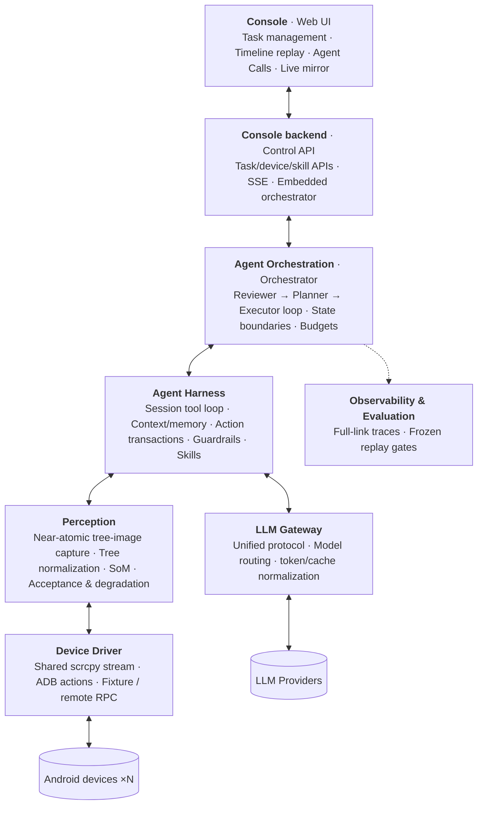
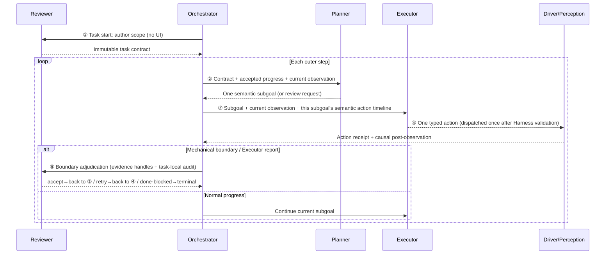
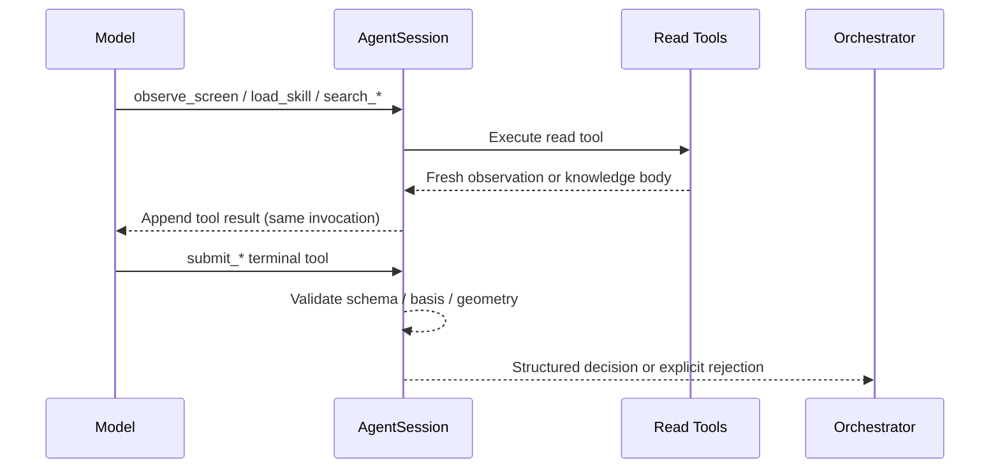
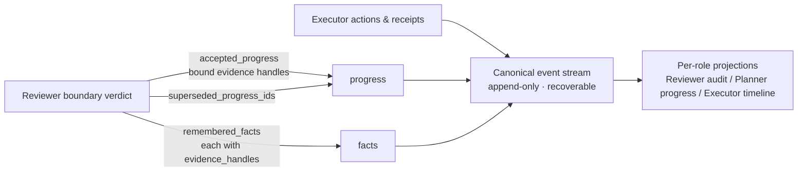
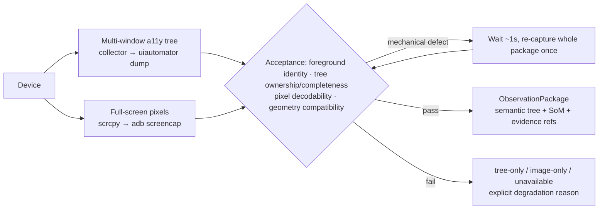

<div align="center">

# 📱 ClickClick

**An evidence-driven mobile GUI agent for complex long-horizon tasks**

Drive Android phones with natural language, with a unified Console for task management and observability

📖 [中文](README.zh-CN.md) &nbsp;|&nbsp; 🚀 [Quick Start](#quick-start) &nbsp;|&nbsp; 🏗️ [Architecture](#architecture-overview) &nbsp;|&nbsp; 📚 [Docs](docs/) &nbsp;|&nbsp; 🧩 [Skill Guide](skills/README.md)

[](pyproject.toml)
[](LICENSE)
[](docs/accessibility-collector-setup.md)

</div>

Core philosophy: **semantic judgment stays with the model; protocol constraints, reliable evidence capture, coordinate transforms, single-shot execution and audit stay with the Harness**. The model understands pages, plans directions, and verifies outcomes; the Harness turns everything into a deterministic, replayable, accountable runtime. For long-horizon tasks the dominant failure mode is not "misreading the screen" but "forgetting what it already did, mistaking a stale screen for new progress" — so the whole architecture is organized around **contracts + evidence**: define verifiable success criteria first, then require every step of progress to cite traceable observational evidence (see [Evidence-Driven](#evidence-driven-from-contract-to-verdict)).

<div align="center">
  
</div>

## Architecture Overview

Seven layers, bottom-up: the **Device Driver layer** hides ADB/scrcpy differences; the **Perception layer** turns the screen into citable observational evidence; the **LLM Gateway** unifies model protocols; the **Agent Harness** provides tools, sessions, memory and guardrails; the **Agent Orchestration layer** drives the three-role decision loop; **Observability & Evaluation** records traces throughout; the **Console** presents all of it to humans.



A request flows down the spine: Console submits a task → Control API → the orchestration layer drives the three roles → the Harness organizes sessions and tools → Perception gathers evidence → the Driver operates the device. Model calls branch sideways through the LLM Gateway, and full-link traces feed Observability & Evaluation. Console Live and agent observation reuse the same scrcpy video source from the Driver layer (omitted from the diagram).

| Layer | Responsibility | Code |
| --- | --- | --- |
| **Console** | Task creation / multi-device fan-out, replay by real role calls, Live view and skill review | [web/](web/), [control_api/](control_api/) |
| **Agent Orchestration** | Three-role rotation, task state machine, mechanical boundaries and terminal verdicts | [agent/orchestrator.py](agent/orchestrator.py) |
| **Agent Harness** | Session & tool loop, context/memory management, action transactions, guardrails, skill loading | [agent/session.py](agent/session.py), [agent/action_observation.py](agent/action_observation.py) |
| **LLM Gateway** | Unified model protocol and error taxonomy, per-role model routing, token/cache metrics | [shared/llm_gateway.py](shared/llm_gateway.py) |
| **Perception** | Near-atomic tree-image capture, tree normalization, SoM rendering, observation acceptance & degradation | [perception/](perception/) |
| **Device Driver** | Action execution, shared video stream, accessibility channel, remote/offline transports | [driver/](driver/) |
| **Observability & Evaluation** | Full-link traces, SSE projections, frozen-task replay gates | [control_api/services.py](control_api/services.py), [evaluation/](evaluation/) |

### Evidence-Driven: From Contract to Verdict

"Evidence-driven" means: **no semantic conclusion (progress, fact, answer, completion) stands unless it is bound to a Harness-verifiable piece of observational evidence** — natural-language claims carry no weight on their own. The implementation is a three-stage chain:

1. **Contract first**: at task start the Reviewer decomposes the goal into verifiable conditions (`must_happen` / `final_ui_state` / `answer`) written into an immutable contract — "what evidence is required" is defined before execution begins.
2. **Evidence during execution**: every capture is issued an `observation_id` binding screenshot, tree, geometry and timestamp into one citable unit; after each dispatch a causal post-observation is captured, and a stale package may only be labeled `pre_action_observation`, never passed off as "current".
3. **Citation at adjudication**: every progress entry, fact and answer from the Reviewer must carry exact evidence handles (`evidence_handles` + condition refs); the Harness validates reference integrity before persisting, and the Planner can only consume progress that was cited.

As a result, the three most common long-horizon hallucinations — **stale screens posing as fresh evidence, look-alike pages posing as target progress, memory claims posing as verified facts** — become structurally impossible rather than merely discouraged. All evidence artifacts are persisted, so any terminal state can be replayed and audited by a human.

---

## Agent Orchestration: The Three-Role Loop

The loop is driven by [agent/orchestrator.py](agent/orchestrator.py); the recoverable source of truth is the persisted `AgentState`. The orchestration layer maintains only the state machine and mechanical boundaries (step counts, invocation counts, failure types) and **makes no semantic judgment** — page meaning, task completion, and recovery direction are all decided by model roles.

### Role Responsibilities

| Role | Does | Explicitly does NOT |
| --- | --- | --- |
| **Reviewer** | Defines the **immutable success contract** at task start (`must_happen` / `final_ui_state` / `answer`); at boundaries, adjudicates `accept / retry / replan / done / blocked` from task-local history, current UI and exact evidence handles; the only role that may write semantic progress, facts and answers | Plan next steps, operate the device, or expand the starting page into a required path |
| **Planner** | Rolls forward **one** executable semantic subgoal with its success criteria (`execute`), or requests a re-check (`review`), based on the immutable contract, accepted progress and current UI | Verify the Executor, terminate the task, or emit action-level click plans |
| **Executor** | Executes **one** typed action (`act`) for the current subgoal, or reports a cognitive boundary: evidence seems sufficient (`request_review`) or the direction is infeasible (`request_replan`) | See the full future plan, write global completion conclusions, or treat stale screens as fresh evidence |

**Subgoal splitting principle**: one subgoal = one independently verifiable user-semantic end state. Consecutive steps merge by default; split only when an intermediate state needs independent verification (canonical case: *finding ≠ opening*). Action-level subgoals (e.g. "tap index 5") are forbidden.

### Interaction Loop



Key points:

- **Reviewer first**: no scope contract, no execution — success criteria exist before any action and stay immutable.
- **Boundaries are handoffs**: when the Executor reaches a cognitive boundary (`request_review` / `request_replan`) or a mechanical one (dispatch failure, missing observation), control goes to the Reviewer; non-terminal verdicts route back to the Planner. The Harness never picks recovery strategies from text or counters.
- **Terminal answers converge at the Reviewer**: answers are written only by the Reviewer at `done`, cited by evidence; Planner/Executor never ghost-write them.
- **Mechanical ceilings**: `max_steps` (default 50) and the role-invocation cap (default 200) are the only hard stops; exhaustion is an explicit failure.

---

## Agent Harness

The Harness is the deterministic runtime wrapping the model: [agent/session.py](agent/session.py) (sessions), [agent/action_observation.py](agent/action_observation.py) (action transactions), [agent/decision_context.py](agent/decision_context.py) (context projections), [agent/task_memory.py](agent/task_memory.py) (memory). It maintains only cross-app runtime protocols and safety invariants — never per-app page state machines.

### Session Management (Session Harness)

Each role invocation is carried by an `AgentSession`: it assembles a stable context (system policy → skill bodies → history → current observation) and drives a bounded tool loop with `tool_choice=required` (default max 8 model rounds per invocation) until the model submits a decision via a terminal tool.



Plain-text responses are not legal results: the Harness nudges once inside the invocation, and a persistent violation is classified `malformed` and handed to the orchestrator's configured retry policy — "hand-written JSON" in content is never parsed.

### Tools & Permissions

Tools come in four categories: `knowledge` (skills), `observation` (screen reads), `device_discovery` (app discovery), `terminal` (final submissions). **Permissions are least-privilege per role** — the judge has no device capability, the planner has no verdict power, the executor has no termination power:

| Tool | Reviewer scope | Reviewer boundary | Planner | Executor |
| --- | :-: | :-: | :-: | :-: |
| `observe_screen(current \| temporal)` | — | ✓ | ✓ | ✓ |
| `load_skill` / `search_skills` | — | — | ✓ | ✓ |
| `search_installed_apps` | — | — | — | ✓ |
| `submit_reviewer_scope` / `submit_reviewer_decision` | ✓ | ✓ | — | — |
| `submit_planner_decision` | — | — | ✓ | — |
| `submit_executor_step` | — | — | — | ✓ |

**Device actions are not repeatedly callable model tools** — they are terminal payloads of `submit_executor_step` (`tap / tap_xy / type / swipe / long_press / scroll / drag / key / launch / sleep`). The Harness validates schema, active observation, coordinate space and index, then the action transaction **dispatches at most once**. `sleep` only waits and explicitly records zero capture — it cannot serve as evidence; `observe_screen` is the model's only explicit path to fresh evidence.

### Guardrails & Correction

| Invariant | Behavior |
| --- | --- |
| **Terminal results are tool calls only** | Every round sends `tool_choice=required`; after one in-call correction, violations fail explicitly as `malformed` |
| **One active observation** | Exactly one actionable observation per round; `observe_screen(current)` re-captures and replaces the old package wholesale; for temporal only the last frame is an action basis |
| **Actions bind the basis atomically** | The model never copies opaque basis ids; the Harness binds the current active observation atomically at submission; stale/ambiguous bases suppress dispatch outright |
| **Auditable coordinate transforms** | Only the basis's own image→device transform plus bounds validation; out-of-bounds suppresses — no snapping to a11y nodes, no clamping to screen edges |
| **Dispatch at most once** | Receipts separate `dispatch_succeeded` from `effect_outcome` (confirmed / unknown / timeout / suppressed / failed); uncertainty is a legitimate result — never re-fire or fake success |
| **Recovery stays at the failing layer** | Malformed calls retry within the same role; the first mechanical observation anomaly triggers exactly one bounded full re-capture; grounding rejections may retry once on a fresh observation; semantic direction goes to Reviewer/Planner |
| **Business policy lives in prompts/skills** | Playback judgment, filter setup, app-specific gestures are all model behavior guided by skill bodies; the Harness hardcodes nothing by package name or page text |

Sensitive data (e.g. password input) is redacted end-to-end across actions, pipelines, tool observations and memory.

### Context Management

Following mainstream convention, **context management owns "what the model sees this call, and in what order"** — the transient assembly of the context window; what to remember and how to consolidate belongs to memory management (next section). The model never receives an ever-growing raw trajectory; it receives **deterministic projections** trimmed per role (Decision Context, see [agent/decision_context.py](agent/decision_context.py)):

| Projection | Contents | Visible to |
| --- | --- | --- |
| Task contract projection | Immutable success criteria with per-condition accepted / active / pending status | Reviewer + Planner |
| Active subgoal contract | Current subgoal, kind and success criteria | Planner + Executor |
| Semantic action timeline | Intents / action types / dispatched-or-not / observation-obtained within the current subgoal lineage (no coordinates, no indices) | Executor; also projected to the Planner at recovery boundaries |
| Runtime budget | Mechanical resources such as remaining steps | Each role sees only what it needs |

Memory lands in the **H (HISTORY)** bucket, separate from the **O (current OBSERVATION)** bucket: a screen change only replaces O, never flushing accepted Facts/Progress.

### Memory Management (TaskMemory)

Complementing context management, **memory management owns "what to remember, how it consolidates, and how later calls retrieve it"** — the lifecycle of persistent state. Cross-step working memory lives at `AgentState.task_memory`: `facts` (semantic memory: Reviewer-accepted key-values), `progress` (semantic progress bound to exact evidence), and `events` (episodic memory: the single append-only event stream from which restarts recover). Skill bodies serve as cross-task procedural memory, consolidated asynchronously by the SkillLearner (see [Skills](#skills)).



**Write access converges on the Reviewer**: the Executor only acts and reports boundaries — it never writes memory directly; no progress or fact persists without evidence handles. Memory stores semantics only (intents, conclusions, evidence references) — no device indices or coordinates; the full raw trajectory stays in the Trace for replay and the SkillLearner.

### Skills

Skills are **Markdown priors in the filesystem** (not ADB macros, not a database table) — see the authoring guide in [skills/README.md](skills/README.md):

```
skills/generic/<name>/SKILL.md                 # Generic capabilities (e.g. permission dialogs)
skills/apps/<package>/core/SKILL.md            # App core knowledge
skills/apps/<package>/workflows/<id>/SKILL.md  # App workflows
skills/_pending/                               # SkillLearner output, awaiting approval
```

- Rules are classified as `Constraints / Hints / Fallbacks / Anti-patterns` and can be delivered per role section.
- **Loaded by exact foreground app**: all three loop roles receive only the current foreground app's core + all active workflows — no global catalog search, no routing by task text.
- **SkillLearner** ([agent/skills/learner.py](agent/skills/learner.py)): optionally summarizes experience asynchronously after task termination → `_pending/`; enters the hot path only after human approval and repeated verification; never participates in the online loop.
- App launch resolution is deterministic: exact package → curated alias → learned alias; on a miss the Harness issues a one-time short-lived ticket, and the Executor re-submits an exact package after querying a bounded installed-app list.

---

## Perception Layer

The perception layer turns the device screen into **citable observational evidence packages** for the model: [perception/observation.py](perception/observation.py), [perception/normalizer.py](perception/normalizer.py), [perception/som.py](perception/som.py).

### Design Philosophy: Near-Atomic Tree-Image Package Capture

Every model decision depends on both **structure (a11y tree) and pixels (screenshot)**. If the two come from different moments, cross-source conflicts like "tree says results loaded, screenshot still blank" directly cause misjudgments. So the perception layer treats one tree + one pixel capture as a single **tree-image package (`ObservationPackage`)**, using `observation_id` to bind screenshot, tree, geometry and timestamp into one unit of evidence:

1. **Same-transaction capture**: one full capture fetches the multi-window a11y tree and scrcpy-first pixels in parallel under a single cancellable deadline, verifying the exact foreground identity before and after to keep the package self-consistent.
2. **If unstable, re-capture the whole package — exactly once**: on a clear mechanical defect (identity conflict, incomplete tree, undecodable pixels, incompatible geometry), wait ~1s and **re-capture once, whole-package** — no per-field patching, no chasing a perfect same-moment fixed point between tree and pixels.
3. **Honest delivery by real capability**: the output is one of indexed tree+image / tree-only / image-only / typed unavailable — gaps are never faked to "look complete".
4. **No semantic hole-filling**: no CV/OCR auto-completion, no "guessed indices"; page stability, action effect, and task completion are all judged by the model.



### Key Implementation

- **Full-screen observation**: observations are always full-screen-bounded, avoiding context loss from local crops or extra coordinate systems; `FrameGeometry` describes the reversible transform across stream pixels → model image → device logical coordinates, so actions never depend on guessed scale factors.
- **Independent dual-source fallback**: trees follow "on-device Accessibility Collector → `uiautomator dump`", pixels follow "scrcpy decoded frame → `adb screencap`" — neither chain degrades because the other failed.
- **SoM (Set-of-Mark)**: when the tree is complete and aligned, the Executor receives a single-pass a11y-only SoM (marks are real nodes — no hallucinated boxes); Reviewer/Planner receive clean screenshots. When the tree is untrustworthy, delivery degrades honestly to a clean image.
- **Focus & input evidence**: `focused_element` / `focused_editable` are extracted independently from the active window and overlays, so WebView containers cannot shadow the real EditText; password fields are redacted throughout.
- **Temporal evidence**: `observe_screen(temporal)` samples 2–3 ordered full-screen frames backwards from the current call (only the last frame is actionable), serving playback, progress, loading and any scenario where "change itself is the evidence".

---

## Device Driver Layer

[driver/](driver/) hides device I/O differences: ADB executes actions and carries captures ([driver/android.py](driver/android.py)); scrcpy provides a per-device shared video session ([driver/scrcpy_mirror.py](driver/scrcpy_mirror.py)) — one encoded stream fans out to browser Live, another is host-decoded into a bounded FrameRing for agent frame reads; consumers hold independent leases and never stop each other. Non-ASCII text is injected via the ADBKeyboard IME; device initialization (Collector install, IME switching, health checks) lives in [driver/environment.py](driver/environment.py).

Transports are selected uniformly by [driver/factory.py](driver/factory.py):

| Condition | Transport |
| --- | --- |
| `CLICKCLICK_USE_FIXTURE_DRIVER=1` | `FixtureDriver` (offline/testing, no device needed) |
| `CLICKCLICK_DRIVER_URL` set | `DriverClient` (HTTP RPC to a remote driver process) |
| Otherwise | In-process `AndroidDriver` (direct local ADB) |

Multi-device management lives in [driver/pool.py](driver/pool.py): device keys are `serial` (local) or `driver_id/serial` (remote hub), each device gets one mutex, and tasks on different devices run concurrently.

---

## LLM Gateway

[shared/llm_gateway.py](shared/llm_gateway.py) unifies the Chat Completions protocol on top of LiteLLM and is itself **sessionless** (multi-turn state is held by the Session Harness):

- **Error taxonomy**: `transient / auth / malformed / budget / config / content_safety` — the orchestration layer retries or terminates by category and never treats a timeout as business failure.
- **Metrics normalization**: unified input / output / cache_read / cache_write / reasoning token semantics for Console cost diagnostics.
- **Model routing** ([shared/model_router.py](shared/model_router.py)): Reviewer and Planner share the decision model, the Executor is configured separately, the SkillLearner may override further; relay keys and ChatGPT Pro/Max subscriptions coexist.
- Native model reasoning summaries go to diagnostic metadata only — never goal evidence, never fed back into memory.

---

## Observability & Evaluation

- **Full trace persistence**: `llm_rounds[]`, `tool_calls[]`, action pipelines and lifecycle events are written to SQLite and pushed live over SSE; the Console's LLM Input shows the actual redacted request snapshot assembled by the Session — not a re-synthesized summary.
- **Replay aligned to real calls**: the timeline follows the true Reviewer scope → Planner → Executor → Reviewer boundary sequence; inner tool loops never masquerade as outer role steps; model names, real tokens and cache ratios are shown per call.
- **Evaluation gates** ([evaluation/](evaluation/)): frozen-task replay, zero-device role evaluation, observation-degradation regression — deterministic gates that validate net gains of changes, never on the production path.
- Runtime business logic is strictly separated from presentation: Console fields never enter `AgentState`, prompts, role decisions, or device control.

## Web Console

React + Vite + TS + Tailwind + shadcn/ui ([web/](web/)); task detail is a three-column layout:

- **Left rail — Round Rail**: browse the loop in real role-call order.
- **Center — Step Inspector**: role decisions, semantic tree, LLM I/O, and Agent Calls (model, tool status/timing, evidence, cache metrics).
- **Right — MirrorPanel**: shared scrcpy source `Live` ↔ the selected step's `Frame` (SoM + hit points).

Plus device management (multi-select dispatch, initialization), a Skills review page, and the raw Trace stream.

---

## Deployment

### Process Topology

```
Console  ──HTTP──▶  Control API (with embedded Agent orchestrator)  ──RPC──▶  Driver  ──ADB──▶  Phone
```

See [docs/processes.md](docs/processes.md). In the MVP the orchestrator is embedded in the Control API process; the Driver can be deployed standalone on the host connected to phones. A `clickclick-agent` CLI is available for one-shot runs.

### Quick Start

```bash
python3 -m venv .venv
source .venv/bin/activate
pip install -e ".[dev]"

# Terminal A — fixture driver (no device needed)
export CLICKCLICK_USE_FIXTURE_DRIVER=1
clickclick-driver

# Terminal B — API + Console (with embedded orchestrator)
export CLICKCLICK_DRIVER_URL=http://127.0.0.1:8765
clickclick-api
```

Open [http://127.0.0.1:8080](http://127.0.0.1:8080). One-shot run: `clickclick-agent "Open Xiaohongshu, pick a video post and play it."`

### Three Run Modes

- **Offline fixture**: `CLICKCLICK_USE_FIXTURE_DRIVER=1` — the preferred way to debug loop logic.
- **Local device**: unset fixture; leave `CLICKCLICK_DRIVER_URL` empty for in-process direct ADB, or run a standalone driver and set the variable.
- **Remote driver**: phones attach to a remote host via USB/wireless ADB; that host runs `clickclick-driver`; the platform sets `CLICKCLICK_DRIVER_URL=http://host:8765`. Multi-lab setups use `CLICKCLICK_DRIVER_URLS_JSON` (e.g. `[{"id":"lab-a","url":"http://10.0.0.1:8765"}]`), with device keys as `lab-a/<adb-serial>`. Remote hubs and the platform must ship the same vendored `scrcpy-server`.

### Real Device Setup

1. Enable developer options and USB debugging; `adb devices` shows authorized devices.
2. Get and install the device components (Accessibility Collector + [ADBKeyboard](https://github.com/senzhk/ADBKeyBoard)) — pick one path or go one-click:

**Path A — one-click (recommended)**

```bash
./scripts/bootstrap-device.sh            # single authorized device
./scripts/bootstrap-device.sh <serial>   # pick a serial when several
```

The script prefers in-repo `android/prebuilt/`; if missing, it downloads from the [GitHub Release `collector-v0.2.0`](https://github.com/LordRosenberg/ClickClick/releases/tag/collector-v0.2.0), then enables accessibility / IME.

**Path B — build the Collector yourself**

```bash
# Open android/accessibility-collector/ in Android Studio, then assembleDebug
export CLICKCLICK_ACCESSIBILITY_COLLECTOR_APK_PATH=android/accessibility-collector/app/build/outputs/apk/debug/app-debug.apk
./scripts/bootstrap-device.sh
```

**Path C — download release APKs and install**

```bash
# Collector
curl -fL -O https://github.com/LordRosenberg/ClickClick/releases/download/collector-v0.2.0/clickclick-collector-0.2.0-debug.apk
# ADBKeyboard (release copy or upstream)
curl -fL -O https://github.com/LordRosenberg/ClickClick/releases/download/collector-v0.2.0/ADBKeyboard.apk
adb install -r clickclick-collector-0.2.0-debug.apk
adb install -r ADBKeyboard.apk
# Then via Console / API: POST /api/devices/{serial}/initialize
```

The Collector requires **Android 8.0+ (API 26)**. Some OEMs still require manually enabling accessibility or "allow restricted settings". See [android/prebuilt/README.md](android/prebuilt/README.md) and [docs/accessibility-collector-setup.md](docs/accessibility-collector-setup.md).

3. Live / agent observation uses the in-repo vendored `scrcpy-server`; failures fall back to ADB automatically.

### Ports

| Service | Default port | Override |
| --- | --- | --- |
| Control API | `8080` | `CLICKCLICK_API_PORT` |
| Driver HTTP RPC | `8765` | `clickclick-driver --port` |
| Vite dev server | `5173` | `web/vite.config.ts` (`/api` proxies to 8080 by default) |

## API Overview

Main Control API endpoints (FastAPI; full definitions in [control_api/main.py](control_api/main.py)):

| Endpoint | Purpose |
| --- | --- |
| `POST /api/tasks`, `GET /api/tasks/{id}` | Create (with multi-device fan-out) / query tasks |
| `GET /api/tasks/{id}/stream` | Live SSE trace |
| `GET /api/tasks/{id}/timeline` | Role-call timeline & replay data |
| `GET /api/devices`, `POST /api/devices/{serial}/initialize` | Device list / initialization |
| `GET/POST /api/skills*` | Skill queries & pending review |
| `POST /api/tasks/{id}/learn` | Manually trigger the SkillLearner |
| `GET /api/models` | Redacted model catalog |
| `GET /api/device/mirror/stream` | Live mirror stream (WebSocket; local or relayed via a remote hub's `/mirror/stream`) |

## Development

### Directory Layout

| Directory | Role |
| --- | --- |
| [agent/](agent/) | Orchestration + Harness: `orchestrator.py` scheduling, `session.py` tool protocol, `decision_context.py` projections, `observation_space.py` observation space/coordinates, `action_observation.py` action transactions, plus memory, skills, prompts, traces |
| [perception/](perception/) | Perception: observation building, tree normalization/filtering, SoM, input evidence |
| [driver/](driver/) | Device driver: ADB actions, shared scrcpy stream, Fixture / RPC, device pool |
| [shared/](shared/) | Cross-process shared: config, SQLite, LLM gateway/routing, protocol & schemas, artifacts |
| [control_api/](control_api/) | Console backend: FastAPI routes, SSE, observability queries |
| [web/](web/) | Console frontend (see [web/README.md](web/README.md)) |
| [skills/](skills/) | Skill bodies (`generic/`, `apps/`, `_pending/`) |
| [evaluation/](evaluation/) | Frozen replay & role evaluation gates |
| [tests/](tests/) | pytest; `-m device` for real-device smoke |
| [docs/](docs/) | Process model, Collector setup, scrcpy & decision contract notes |
| [scripts/](scripts/) | Capture channel, observation latency and scenario benchmark scripts |
| [openspec/](openspec/) | OpenSpec specs and change management |

### Frontend Development

```bash
cd web
npm install
npm run dev      # http://127.0.0.1:5173, /api proxies to Control API
npm run build    # outputs to web/dist/, served by Control API; gracefully skipped if absent
```

### Breakpoint Debugging

[.vscode/launch.json](.vscode/launch.json) ships ready-made configs: `Python: Control API (fixture)` (debug the three roles and orchestrator without a device), `Python: Driver (fixture)`, `Python: Agent one-shot`, `Python: Attach (5678)` (with debugpy), `Debug npm dev` (frontend source maps). In multi-process deployments, debug the API and Driver separately; in fixture mode the API can embed the driver for single-process debugging.

### Testing

```bash
.venv/bin/python -m pytest -q            # full regression
.venv/bin/python -m pytest -m device     # real-device smoke
```

## Configuration

See [.env.example](.env.example) (`CLICKCLICK_*`); defaults live in `Settings` in [shared/config.py](shared/config.py). Key points:

- `CLICKCLICK_MODELS_JSON`: `{model_id: {provider, base_url, api_key, max_tokens, reasoning_supported, reasoning}}`; model ids must carry the litellm routing prefix (e.g. `openai/...`); ChatGPT subscription entries use `chatgpt/...` and log in via the Console task-page card or `.venv/bin/python -m shared.chatgpt_login`.
- `CLICKCLICK_DEFAULT_MODEL` / `CLICKCLICK_MANAGER_MODEL` / `CLICKCLICK_EXECUTOR_MODEL` / `CLICKCLICK_SKILL_LEARNER_MODEL`: defaults and per-role overrides (the Manager entry serves both Reviewer and Planner).
- Device-side options keep deployment differences only: `CLICKCLICK_IME_AUTO_SETUP`, `CLICKCLICK_IME_APK_PATH`, `CLICKCLICK_ACCESSIBILITY_COLLECTOR_*`, `CLICKCLICK_DEVICE_STAY_AWAKE_WHILE_PLUGGED`. Action-transaction deadlines, scrcpy ring and fallback thresholds are owned by their modules — no second policy layer via environment variables.
