<div align="center">

# ClickClick

**Give your AI the ability to get things done on Android.**

Cross-app tasks · PC assistant integration · Follow every step

[中文](README.zh-CN.md) · [Benchmark results](https://lordrosenberg.github.io/ClickClick/) · [Demos](#see-it-in-action) · [Quick Start](#connect-your-pc-ai-assistant-with-mcp) · [Source setup](#deployment) · [Docs](#documentation)

[](https://lordrosenberg.github.io/ClickClick/mobileworld/)
[](https://lordrosenberg.github.io/ClickClick/androidworld/)
[](pyproject.toml)
[](LICENSE)
[](docs/deployment.md)

</div>

ClickClick is an open-source Android agent platform. Give it a goal in natural language: transfer information between apps, fill complex forms, manage collections or configure a schedule. It plans the work, operates the device and checks the result, with a web Console that lets you follow every step.

Connect it to your PC AI assistant through **MCP** to delegate phone tasks, check progress, or pause and resume execution directly in chat.

## 95.73% on MobileWorld GUI-only · #1 in our comparison

The latest evaluation scores **106/117 (90.60%) on original tasks** and **112/117 (95.73%) in the comparison incorporating seven clarified supplements**. GPT-5.6-Sol (high), Android API 34, with 50 MobileWorld rounds and 2,400 seconds per task; all 117 original tasks have numeric official evaluator scores. The runtime combines revisable planning, persistent memory, scoped skills and Jev checks.

The comparison incorporates six wording clarifications and one official-account context supplement; other tasks retain their original result. Both scores exceed the published 50-round GUI-only rows checked on October 7, 2026.

**[Per-task scores, screenshots and execution traces →](https://lordrosenberg.github.io/ClickClick/mobileworld/)** · [Clarifications and methodology](docs/mobileworld-results-20261007.md).

## 99.14% on AndroidWorld · tied #2 by success-rate tier

**115 of 116 tasks passed**, covering multi-step tasks across Android apps. Evaluated with `chatgpt/gpt-5.6-sol` (high) on Android API 33 using AndroidWorld's official success checks.

**[Explore the results and execution traces →](https://lordrosenberg.github.io/ClickClick/androidworld/)** Browse all 116 tasks, filter by outcome, and inspect scores, actions and recorded screen states. [Evaluation methodology](docs/androidworld-results-20260921.md).


At the [public leaderboard](https://docs.google.com/spreadsheets/d/1cchzP9dlTZ3WXQTfYNhh3avxoLipqHN75v1Tb86uhHo/edit?gid=0)'s one-decimal precision, our result ties Artemis at 99.1% in the second distinct success-rate tier, behind the 100% tier (checked October 2, 2026).

## See it in action

### MobileWorld demos

Six successful cross-app tasks. Click a preview to watch the **complete video at 3× speed**.

| Project risk matrix | Resource conflicts | Research to shopping plan |
| --- | --- | --- |
| [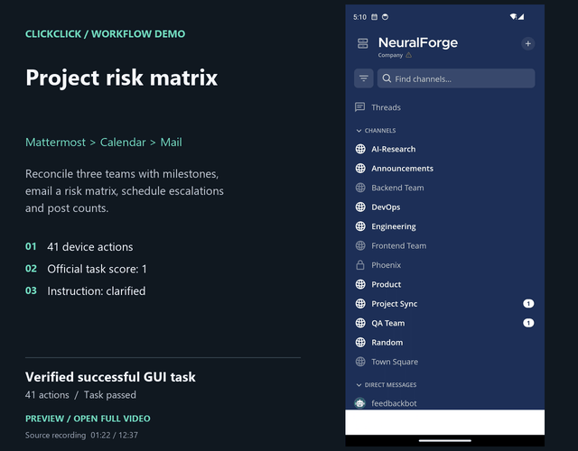](docs/assets/demos/mobileworld/project-risk-matrix.mp4) | [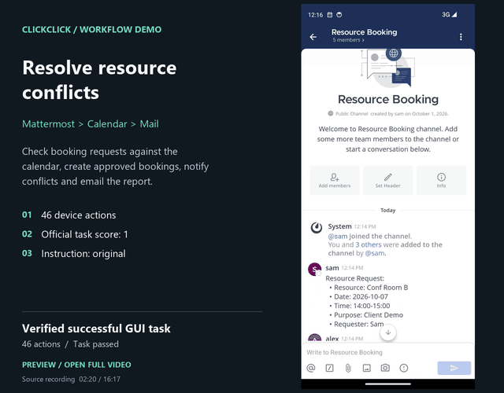](docs/assets/demos/mobileworld/resource-conflicts.mp4) | [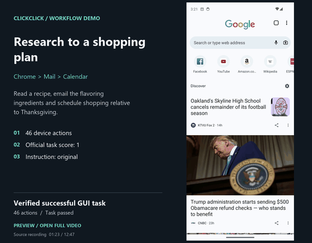](docs/assets/demos/mobileworld/thanksgiving-preparation.mp4) |

| Lectures to calendar | Archive files and email record | Photos by travel location |
| --- | --- | --- |
| [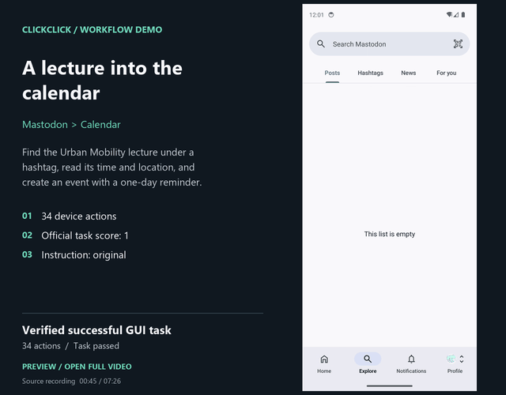](docs/assets/demos/mobileworld/lectures-to-calendar.mp4) | [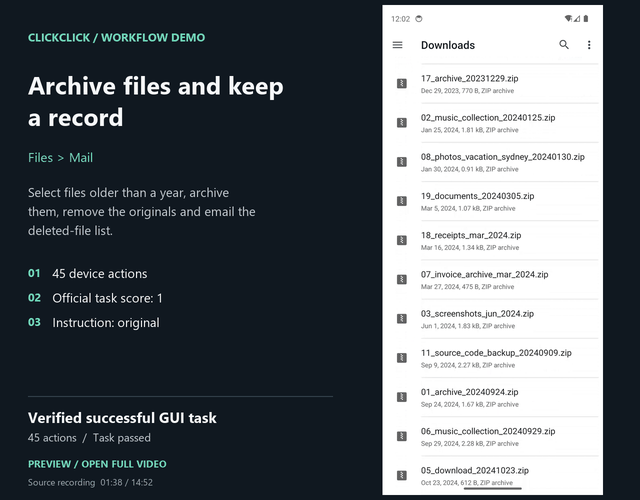](docs/assets/demos/mobileworld/archive-old-files.mp4) | [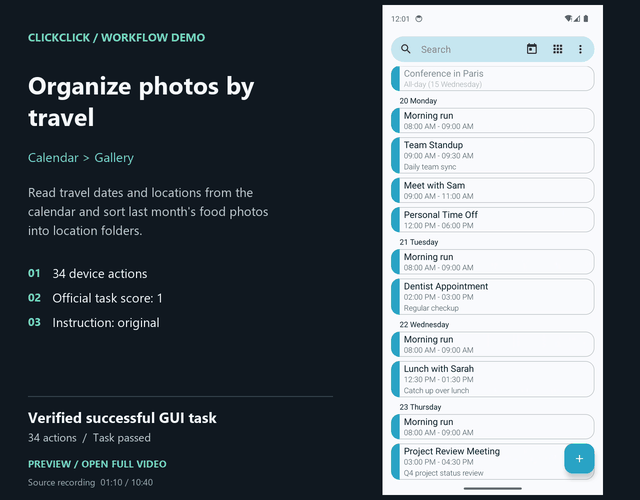](docs/assets/demos/mobileworld/photos-by-travel-location.mp4) |

[Video details](docs/demos.md#mobileworld-recordings--mobileworld-录屏) · [Latest screenshots and execution traces](https://lordrosenberg.github.io/ClickClick/mobileworld/)

### AndroidWorld demos


Real recordings of successful tasks. Click a preview to open the complete video at **3× speed**.

| Notes → recipes | Image → expense records | Recurring calendar event |
| --- | --- | --- |
| [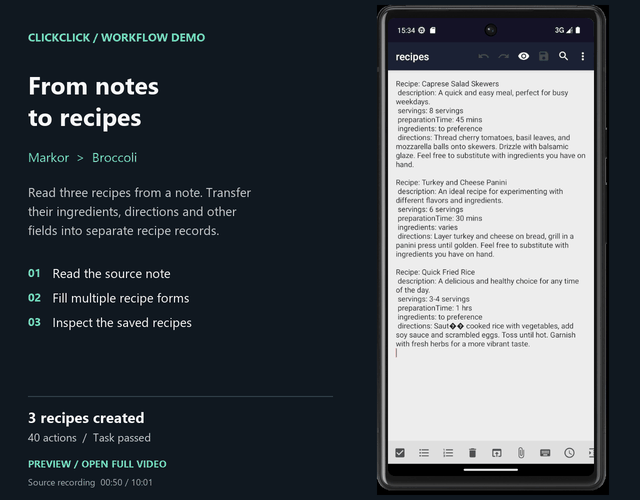](docs/assets/demos/notes-to-recipes.mp4) | [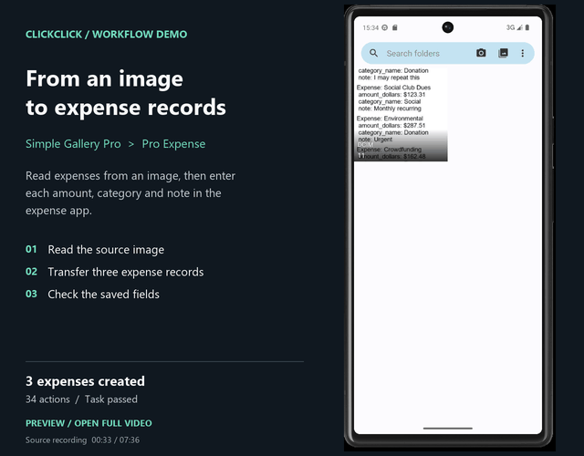](docs/assets/demos/image-to-expenses.mp4) | [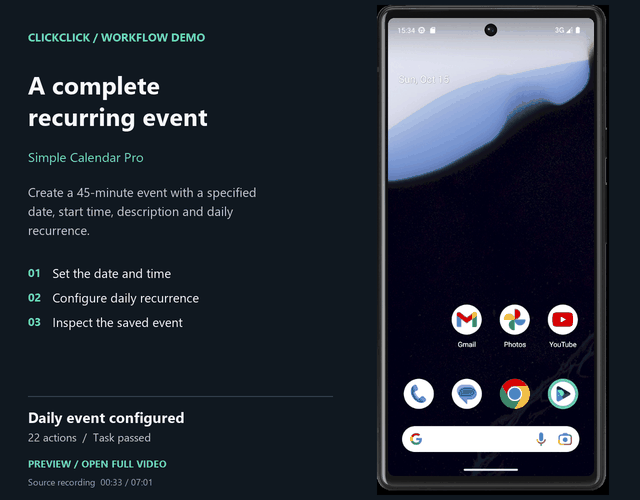](docs/assets/demos/recurring-calendar-event.mp4) |
| Read a note and create **three recipes**, preserving ingredients, directions and other fields. | Read a source image and enter **three expenses** with their amounts, categories and notes. | Set the date, start time, **45-minute duration**, description and daily recurrence. |

| Deduplicate expenses | Create an ordered playlist | Summarize weekly activity |
| --- | --- | --- |
| [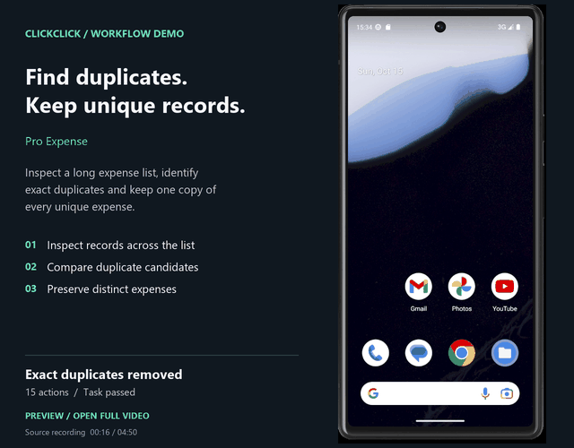](docs/assets/demos/deduplicate-expenses.mp4) | [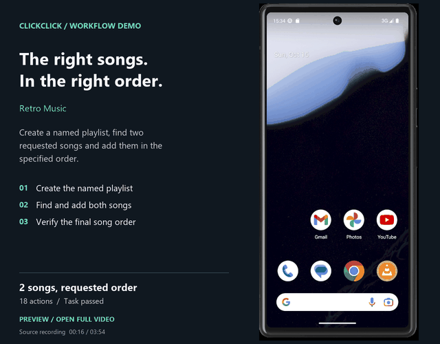](docs/assets/demos/ordered-playlist.mp4) | [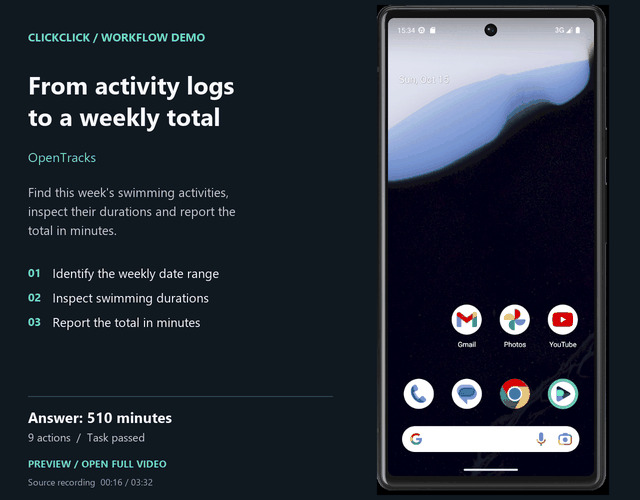](docs/assets/demos/weekly-activity-summary.mp4) |
| Inspect a long expense list, remove **exact duplicates** and retain one copy of every unique expense. | Create a named playlist, find **two songs** and verify their requested order. | Find **this week's swimming activities**, inspect durations and report the total in minutes. |

[Task instructions and recording details](docs/demos.md)

## Built for complex tasks

- **Plan, act and adapt.** Break a goal into meaningful stages, change course when the screen reveals new information, and continue from completed work. Independent review is available when a task needs another judgment.
- **Carry information across apps.** Keep versioned notes and retained excerpts independently of structured history summaries. Summary items cite durable sources; recent full steps remain available, and missing details can be recalled from notes, screenshots and original records. [Memory and context](docs/architecture.md#context-memory-and-skills)
- **Interact reliably with real interfaces.** Combine screenshots and accessibility structure to locate controls. Bind supported clicks to observed native nodes, verify text entry, and feed action results back into the next decision.
- **Teach reusable app skills.** Add application knowledge without retraining the model. Learn procedures and pitfalls from task records through independent review and necessary verification, with multi-app candidates and local admission into pending review. [Skill self-improvement](docs/skill-evolution.md). Share app-owned interface knowledge across devices, bind system-interface guidance to device profiles, and reuse general skills across apps. Supported compound actions can inspect a detail page and return while preserving what was read.
- **Choose your model and device.** Configure models for planning and execution, connect local phones or emulators, or host devices behind a remote Driver.

The agent harness brings these capabilities together: **revisable plans + persistent memory + scoped skills + device feedback**. [Technical overview](docs/reliability-design.md)

## See and understand every run

The Console puts saved observation screenshots and the agent's execution history in one workspace.

- **Watch progress:** follow newly recorded screenshots, the current stage and streaming model responses.
- **Browse past runs:** page through task summaries, filter failures and open execution details on demand.
- **Inspect decisions:** open a Timeline call to see the actual model input, returned decision, active skills, tool calls and associated screenshot.
- **Diagnose failures:** trace an action to its target, receipt and resulting observation; revisit screenshots from the selected call or model round without capturing the phone again.
- **Understand resource use:** inspect task and model latency, call counts and reported input, output and cache usage.

[Console and observability guide →](docs/observability.md)

## Architecture

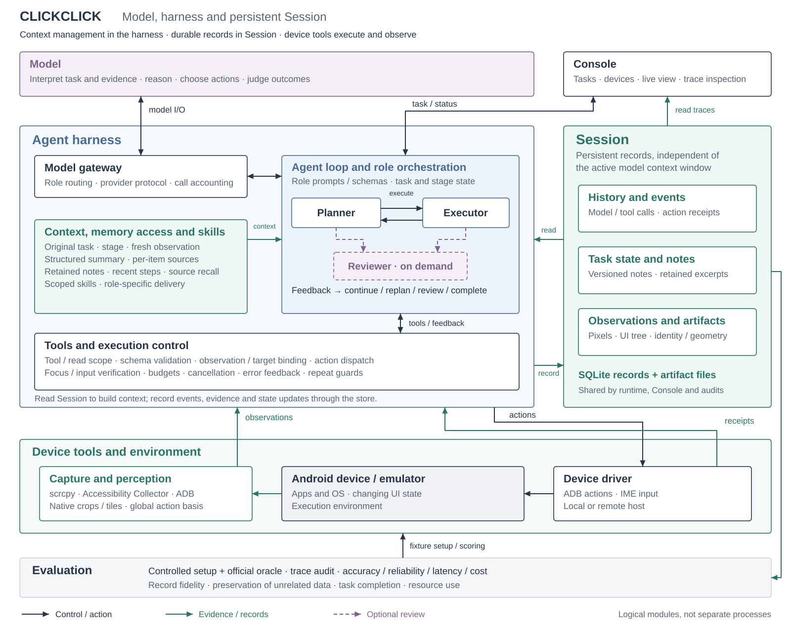

**Planner → Executor → observation → continue or replan**, with Reviewer available on demand. The harness manages context, skills and execution; a persistent Session retains task evidence; Android tools supply actions and observations. Console exposes the run, and external evaluators check task outcomes.

The harness assembles the original task, current stage, fresh observation, structured summary, recent full steps and retained notes separately. Observation packages carry pixels, UI structure, identity and geometry; native detail crops or tiles support reading while actions remain grounded in the fresh global observation.

[Architecture and module interfaces](docs/architecture.md) · [Design decisions](docs/design-decisions.md)

## Connect your PC AI assistant with MCP

Connect ClickClick to a PC AI assistant that supports MCP. Delegate phone tasks in chat, ask for progress, and pause, resume or cancel when needed.

### Recommended: let your AI assistant install and connect

If your assistant can run commands on this PC, send it this prompt to handle downloading, installation, phone connection and MCP setup:

> Install and connect ClickClick on this PC (https://github.com/LordRosenberg/ClickClick). Follow the installation guide, detect Windows/macOS and CPU architecture, download the matching official Release installer and verify its published SHA-256. If unavailable, follow source deployment; do not treat a source ZIP as an installer. Check the installation exit status and backend identity. Open local settings so I can choose subscription login or an API; guide official authorization and let me enter API keys in the page, keeping them out of chat. Ask whether I want Wi-Fi, USB or an existing emulator, handle PC-side connection and guide phone debugging and permission prompts. Obtain the generated assistant connection prompt from Settings, read the local stdio configuration at its complete path, and register clickclick through your own official MCP command or configuration entry, preserving existing settings. If exporting with the installed ClickClick CLI, explicitly specify --client generic --transport stdio --output with a complete local file path, then read that file; do not use ClickClick register instead of your own registration mechanism. If this session can load MCP, call get_status to check model configuration and device initialization, and share the Console URL. If I must restart the client or open a new session, report "registered, verification pending", give exact steps, and provide this standalone instruction for the new session: "Call ClickClick get_status, check the connection, model configuration and phone initialization, and report readiness and unfinished steps." Registration and ADB connectivity alone are not successful verification. get_status makes no model requests or phone test tasks; run an actual phone test only when I explicitly request it.

Choose Codex subscription login or an API in settings, complete model and phone authorization, and approve assistant actions. [Detailed installation guide](docs/local-mcp.md#let-a-local-assistant-install-it)

### Manual installation

1. **Install ClickClick.** Choose an installer for your Windows or macOS PC from [GitHub Releases](https://github.com/LordRosenberg/ClickClick/releases). If no matching installer is available, follow the [source deployment guide](docs/deployment.md).
2. **Configure a model and connect your phone.** Open settings, choose Codex subscription login or configure an API, and connect Android over Wi-Fi or USB. An existing emulator also works. Follow the prompts to enable debugging and approve permissions on the phone.
3. **Connect your assistant.** Copy the assistant connection prompt from Settings, or use the client-specific commands/configuration under Manual setup. If the client requires a new session, use the separate connection verification prompt shown on the page.

### Try a task

Once connected, describe what you want done in your assistant's chat:

> Use ClickClick to copy the three recipes in this note into my recipe app. Preserve ingredients and directions, check the saved records, and tell me whether the task is complete.

During a task, ask “How is it going?” or “Pause this task.” Ask for the Console link to see execution steps and saved screenshots. Keep the PC and phone online while tasks run.

[MCP setup guide](docs/local-mcp.md) · [Desktop installation and phone connection (中文)](docs/desktop-setup.zh-CN.md)

After installation, launch ClickClick from the desktop or Applications entry. Its tray/menu-bar icon opens the Console, starts or stops the backend, and controls login startup. Active tasks can be paused or cancelled before shutdown; closing the browser keeps the backend running.

## Deployment

These steps are for source installation; desktop installer users can skip them. Use Python 3.12, Node.js/npm, Android SDK Platform-Tools and a model service supporting images and tool calls. Start with a locally connected device; see [deployment](docs/deployment.md) for remote hosts.

### 1. Install and configure a model

Run from the repository root:

```bash
# Linux / macOS
python3.12 -m venv .venv
source .venv/bin/activate
python -m pip install -e ".[decode]"
cp .env.example .env
```

```powershell
# Windows PowerShell
py -3.12 -m venv .venv
.\.venv\Scripts\Activate.ps1
python -m pip install -e ".[decode]"
Copy-Item .env.example .env
```

Set your model and credentials in `.env`. For an OpenAI-compatible API:

```dotenv
CLICKCLICK_DEFAULT_MODEL=openai/YOUR_MODEL_ID
CLICKCLICK_MODELS_JSON={"openai/YOUR_MODEL_ID":{"provider":"openai","base_url":"https://YOUR_ENDPOINT/v1","api_key":"YOUR_API_KEY","max_tokens":4096,"reasoning_supported":false}}
CLICKCLICK_DRIVER_URL=
CLICKCLICK_DRIVER_URLS_JSON=
CLICKCLICK_USE_FIXTURE_DRIVER=false
```

See [model configuration](docs/deployment.md#model-routing) for provider options, login-based access and reasoning settings.

### 2. Connect a device

For a phone, enable USB debugging, connect it and accept the authorization prompt. For an emulator, start and unlock it. Run `adb devices`: the intended serial must have status `device`. Resolve `unauthorized` on the phone.

### 3. Start the platform and allow automatic initialization

```bash
npm --prefix web ci
npm --prefix web run build
clickclick-api
```

ClickClick detects connected devices and provisions its Accessibility Collector. Keep the device unlocked and accept Android installation, debugging or accessibility prompts when requested. For text entry, configure the ADBKeyboard APK if it is not already installed; see [input-method setup](docs/deployment.md#input-method-apk).

[Deployment and troubleshooting](docs/deployment.md) covers remote device hosts, Collector installation and model configuration.

### 4. Run your first task

Open [Console](http://127.0.0.1:8080). In the task creation form, choose a decision model, an executor model and one idle device. Enter:

> Open Android Settings, enter Wi-Fi in its search field, inspect the wireless-network settings and report their current state. Do not change any switches.

Click **submit** and follow the task in Console. Select a Timeline call to inspect the model input, tools and saved observation screenshot. Enable follow-latest to track new records, or select a model image to inspect that round's visual input.

## Describe a task in your own words

Tell ClickClick what you want done in Console—for example, “Add the recipes in this Markor note to Broccoli.” The agent plans the steps and operates the apps based on your goal and the current screen. No fixed prompt format or predefined sequence of steps is required.

[Task examples](docs/task-examples.md) illustrate requests you can make. Adapt their apps, wording and data to your needs. Adding app-specific operating knowledge through [skills](skills/README.md) is an optional extension.

You can also select **Optimize my workflow** in task details, authorize the learning budget and device exploration, then inspect candidates, evidence and independent reviews in **Skills → Pending** before approving individual files. Ordinary completion does not start learning automatically, and candidates are not automatically published.

### When should you add a Skill?

Start with a natural-language request; the agent uses applicable skills already included in the repository. Add or improve a Skill when:

- **An app has non-obvious behavior:** unusual save controls, hidden entry points, ambiguous controls or device-specific interactions.
- **Similar tasks repeatedly hit the same problem:** missing fields during transfer, skipped list entries, confused duplicate names or edits that were never saved.
- **You want to reuse proven operating and verification knowledge:** teach later tasks how to perform an operation and check its outcome.

Put the current goal and data in the task request, and reusable app knowledge in a Skill. Skills can reduce known errors but do not guarantee success. Inspect the delivered skills and results in Console. [How to write and validate a Skill →](skills/README.md#when-to-add-a-skill)

## Evaluation and reproduction

For MobileWorld, see the [latest score profile](docs/mobileworld-results-20261007.md). The separately pinned [running guide](docs/mobileworld-reproduction.md) documents preparation and execution for its own fixed configuration.


With model access and the AndroidWorld emulator ready, run all 116 published instances:

```bash
python -m evaluation.androidworld.reproduce --install
```

[Setup, execution and resume guide](evaluation/androidworld/README.md).

Explore per-task scores and execution traces on the [AndroidWorld results site](https://lordrosenberg.github.io/ClickClick/androidworld/). The [evaluation report](docs/androidworld-results-20260921.md) specifies the model, environment, task selection and action accounting behind 115/116. The [evaluation guide](docs/evaluation.md) explains initialization, scoring and reproducibility; the [AndroidWorld adapter](docs/androidworld-benchmark.md) describes how to connect the agent to the benchmark.

## Documentation

| Guide | What you will learn | 中文 |
| --- | --- | --- |
| [PC assistant MCP integration](docs/local-mcp.md) | Setup, eight task tools, progress and pause/resume. | [中文](docs/local-mcp.zh-CN.md) |
| [Desktop setup quickstart](docs/local-mcp.md#desktop-setup) | Installers, subscription/API configuration, Wi-Fi/USB and registration. | [中文](docs/desktop-setup.zh-CN.md) |
| [Technical overview](docs/reliability-design.md) | Design goals and the reasoning behind the core mechanisms. | [中文](docs/reliability-design.zh-CN.md) |
| [Architecture](docs/architecture.md) | Modules, interfaces, execution flow and detailed subsystem designs. | [中文](docs/architecture.zh-CN.md) |
| [Design decisions](docs/design-decisions.md) | Trade-offs in review, context, capture and input. | [中文](docs/design-decisions.zh-CN.md) |
| [Deployment](docs/deployment.md) | Models, devices, installation and remote operation. | [中文](docs/deployment.zh-CN.md) |
| [Observability](docs/observability.md) | Console navigation, traces and performance analysis. | [中文](docs/observability.zh-CN.md) |
| [Task examples](docs/task-examples.md) | Natural-language task examples and result verification. | [中文](docs/task-examples.zh-CN.md) |
| [Evaluation](docs/evaluation.md) | Benchmark setup, scoring and reproduction. | [中文](docs/evaluation.zh-CN.md) |
| [Skills](skills/README.md) | App knowledge, operating guidance and skill authoring. | [中文](skills/README.zh-CN.md) |
| [Skill self-improvement](docs/skill-evolution.md) | Learning from real tasks, independent review, selective validation and capability boundaries. | [中文](docs/skill-evolution.zh-CN.md) |

Licensed under [Apache 2.0](LICENSE).

See [third-party notices](THIRD_PARTY_NOTICES.md) for bundled components.


## Project trends

<a href="https://www.star-history.com/?repos=LordRosenberg%2FClickClick&amp;type=date&amp;legend=top-left">
  <picture>
    <source media="(prefers-color-scheme: dark)" srcset="https://api.star-history.com/chart?repos=LordRosenberg/ClickClick&amp;type=date&amp;theme=dark&amp;legend=top-left" />
    <source media="(prefers-color-scheme: light)" srcset="https://api.star-history.com/chart?repos=LordRosenberg/ClickClick&amp;type=date&amp;legend=top-left" />
    
  </picture>
</a>

[](https://github.com/LordRosenberg/ClickClick/releases)

Star History updates automatically, with a 24-hour cache at the chart provider. Installer downloads refresh hourly and after each desktop release, with one total per day and the last update time shown on the chart. GitHub's image cache may add a display delay. Only Windows/macOS installer assets are counted, including repeat downloads and upgrades; this is not a count of unique users. History starts at the first sample.
