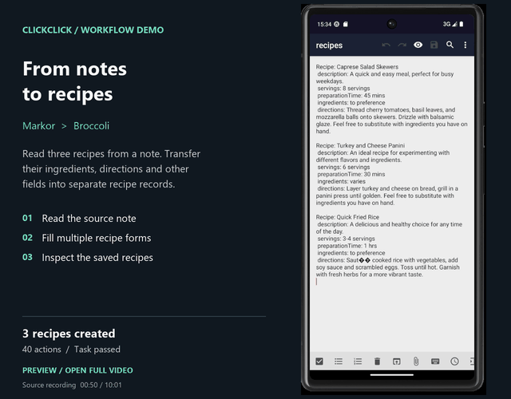
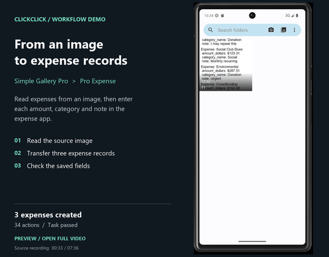
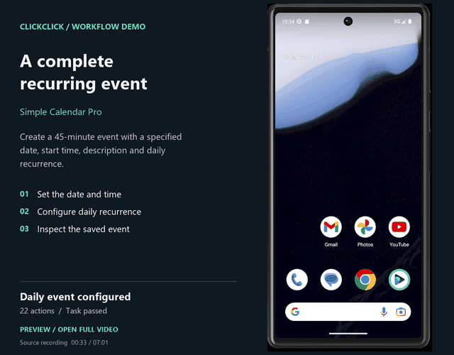
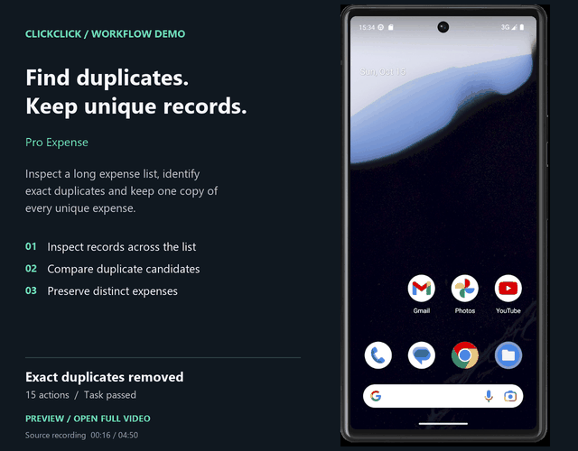
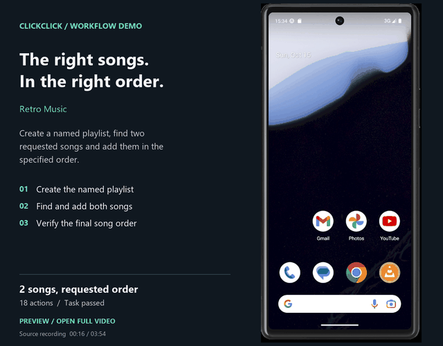
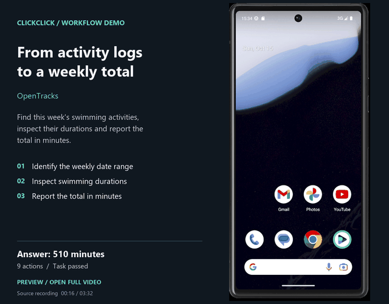

<div align="center">

# ClickClick

**让 AI 在 Android 上完成真正的工作。**

跨应用任务 · 可靠设备交互 · 可复用技能 · 完整执行可观测性

[English](README.md) · [评测成绩](https://lordrosenberg.github.io/ClickClick/androidworld/) · [效果演示](#效果演示) · [快速开始](#部署) · [架构](docs/architecture.zh-CN.md) · [文档](#文档导航)

[](https://lordrosenberg.github.io/ClickClick/androidworld/)
[](pyproject.toml)
[](LICENSE)
[](docs/deployment.zh-CN.md)

</div>

ClickClick 是一个开源 Android Agent 平台。用自然语言描述目标，它就能跨应用搬运信息、填写复杂表单、管理记录、配置日程，并规划步骤、操作设备和检查结果。Web Console 让你随时查看执行进度，深入检查每一次决策。

## AndroidWorld：99.14%

使用 `chatgpt/gpt-5.6-sol`（high）在 Android API 33 上完成评测，**115/116 个任务通过官方评分**。

[成绩与执行轨迹 →](https://lordrosenberg.github.io/ClickClick/androidworld/) · [评测方法与配置](docs/androidworld-results-20260921.md)

## 效果演示

真实成功任务录屏。点击预览，观看 **3 倍速完整视频**。

| 笔记 → 食谱 | 图片 → 费用记录 | 重复日历事件 |
| --- | --- | --- |
| [](docs/assets/demos/notes-to-recipes.mp4) | [](docs/assets/demos/image-to-expenses.mp4) | [](docs/assets/demos/recurring-calendar-event.mp4) |
| 读取笔记，创建 **3 份食谱**，保留食材、做法及其他字段。 | 读取来源图片，录入 **3 条费用**的金额、类别和备注。 | 设置日期、开始时间、**45 分钟时长**、描述和每日重复规则。 |

| 费用去重 | 按顺序创建歌单 | 每周运动时长统计 |
| --- | --- | --- |
| [](docs/assets/demos/deduplicate-expenses.mp4) | [](docs/assets/demos/ordered-playlist.mp4) | [](docs/assets/demos/weekly-activity-summary.mp4) |
| 检查长列表中的费用，删除**完全重复的记录**，每种独立费用保留一条。 | 创建指定名称的歌单，查找 **2 首歌曲**，按要求排序并核对。 | 按**本周与游泳类别**定位活动，检查时长并给出分钟数汇总。 |

[任务指令与录屏说明](docs/demos.md)

## 为复杂任务而构建

- **自主规划，随执行调整。** 将目标拆成有意义的阶段，根据实际页面修订后续路线，延续已完成的工作；需要独立判断时调用 Reviewer。
- **跨应用记住关键信息。** 任务笔记独立于对话摘要保存，选出的简短事实可在长流程中持续可见。需要细节时，可回读完整笔记、早先的截图和来源记录。[记忆与上下文管理](docs/architecture.zh-CN.md#上下文记忆与技能)
- **可靠操作真实界面。** 结合截图与无障碍结构定位控件，将支持的点击绑定到被观察的原生节点，检查文本输入，并根据动作反馈决定下一步。
- **把应用经验变成可复用技能。** 无需重新训练模型即可扩展应用知识。应用自身的界面经验可跨设备共享，系统界面知识按设备配置匹配，通用技能可跨应用复用；受支持的复合动作可完成详情读取和返回，同时保留中间证据。
- **自由选择模型与设备。** 为规划和执行配置模型，连接本地真机或模拟器，也可通过远程 Driver 管理设备。

Agent Harness 将 **可修订规划、持久记忆、作用域技能和设备反馈** 组织成完整执行流程。[技术概览](docs/reliability-design.zh-CN.md)

## 看见并理解每次执行

Console 将实时设备画面与 Agent 执行历史放在同一个工作区。

- **跟随进度：** 查看实时投屏、当前阶段和流式模型响应。
- **浏览历史任务：** 分页查看任务概览，筛选失败任务，按需打开执行详情。
- **检查决策：** 打开 Timeline 调用，查看实际模型输入、返回决策、激活技能、工具调用和关联截图。
- **定位问题：** 沿动作追查目标、回执和结果观测，回看历史页面，并随时切回设备当前画面。
- **分析开销：** 查看任务与模型耗时、调用次数，以及提供方返回的输入、输出和缓存用量。

[Console 与可观测性指南 →](docs/observability.zh-CN.md)

## 核心架构


默认循环为 **Planner → Executor → 观测 → 继续或重规划**，Reviewer 按需介入。Harness 管理上下文、技能与执行，持久 Session 保存任务证据，Android 工具提供动作和观测；Console 展示执行过程，外部评测器检查任务结果。

[架构与模块接口](docs/architecture.zh-CN.md) · [设计取舍](docs/design-decisions.zh-CN.md)

## 部署

需要 Python 3.12、Node.js/npm、Android SDK Platform-Tools，以及支持图像和工具调用的模型服务。先从本机连接的设备开始；远程部署见[部署指南](docs/deployment.zh-CN.md)。

### 1. 安装服务并配置模型

在仓库根目录执行：

```bash
# Linux / macOS
python3.12 -m venv .venv
source .venv/bin/activate
python -m pip install -e ".[decode]"
cp .env.example .env
```

```powershell
# Windows PowerShell
py -3.12 -m venv .venv
.\.venv\Scripts\Activate.ps1
python -m pip install -e ".[decode]"
Copy-Item .env.example .env
```

在 `.env` 中配置模型与凭据，例如使用兼容 OpenAI 的 API：

```dotenv
CLICKCLICK_DEFAULT_MODEL=openai/YOUR_MODEL_ID
CLICKCLICK_MODELS_JSON={"openai/YOUR_MODEL_ID":{"provider":"openai","base_url":"https://YOUR_ENDPOINT/v1","api_key":"YOUR_API_KEY","max_tokens":4096,"reasoning_supported":false}}
CLICKCLICK_DRIVER_URL=
CLICKCLICK_DRIVER_URLS_JSON=
CLICKCLICK_USE_FIXTURE_DRIVER=false
```

其他提供方、登录接入及推理参数见[模型配置](docs/deployment.zh-CN.md#model-routing)。

### 2. 连接设备

真机开启 USB 调试、连接电脑并接受设备上的授权提示；模拟器先启动并解锁。执行 `adb devices`，确认目标序列号后显示 `device`。若显示 `unauthorized`，在手机上完成授权。

### 3. 启动平台，等待自动初始化

```bash
npm --prefix web ci
npm --prefix web run build
clickclick-api
```

ClickClick 自动检测设备并部署 Accessibility Collector。保持设备解锁，按 Android 提示允许安装、调试或无障碍权限。如果设备尚未安装 ADBKeyboard，请按[输入法配置](docs/deployment.zh-CN.md#input-method-apk)提供 APK，以启用文本输入。

远程设备、Collector 安装与连接排查见[部署指南](docs/deployment.zh-CN.md)。

### 4. 运行首次任务并检查效果

打开 [Console](http://127.0.0.1:8080)，在任务创建区选择 decision model、executor model 和一个空闲设备，输入：

> 打开系统设置，在搜索框输入 Wi-Fi，查看无线网络相关设置并报告当前状态，不修改任何开关。

点击 **submit**，在 Console 中跟随执行进度。选择 Timeline 中的调用可查看模型输入、工具和截图；**Live** 展示设备当前画面，**Frame** 展示所选步骤的历史画面。

## 用自然语言下达任务

直接在 Console 中描述你想完成的事，例如：“把 Markor 里这篇笔记中的食谱添加到 Broccoli。”Agent 会根据目标和实际页面规划步骤、操作应用。无需固定提示词格式，也无需预先编排操作流程。

[任务示例](docs/task-examples.zh-CN.md)展示可以交给 Agent 的任务。示例中的应用、措辞和数据都可以按需替换；希望补充特定应用的操作经验时，可参考[技能指南](skills/README.zh-CN.md)，这是可选扩展。

### 什么时候值得补充 Skill？

普通任务可以直接用自然语言提交，Agent 会使用仓库已有的适用技能。以下情况值得补充或改进 Skill，以提高同类任务的成功率：

- **应用操作不直观：** 特殊保存方式、隐藏入口、容易混淆的控件，或特定系统版本的交互差异。
- **同类任务反复踩坑：** 跨应用转录丢字段、长列表漏项、同名记录误判，或填完后没有真正保存。
- **需要稳定复用操作与核验经验：** 将已经验证的方法沉淀下来，让后续任务知道如何操作、如何检查结果。

本次任务的目标和具体数据写在指令里，可复用的应用经验写入 Skill。Skill 能减少已知错误，不能保证每次成功；可在 Console 中检查实际加载内容和执行结果。[如何编写和验证 Skill →](skills/README.zh-CN.md#when-to-add-a-skill)

## 评测与复现

准备好模型与 AndroidWorld 模拟器后，可一键运行公开的 116 个任务实例：

```bash
python -m evaluation.androidworld.reproduce --install
```

[完整准备、运行与恢复指南](evaluation/androidworld/README.md)。

在 [AndroidWorld 成绩页](https://lordrosenberg.github.io/ClickClick/androidworld/)查看逐项评分与执行轨迹。[评测报告](docs/androidworld-results-20260921.md)说明 115/116 对应的模型、环境、任务选择和动作计数；[评测指南](docs/evaluation.zh-CN.md)介绍初始化、评分和复现条件，[AndroidWorld 适配器](docs/androidworld-benchmark.md)说明基准接入方法。

## 文档导航

| 文档 | 内容 | English |
| --- | --- | --- |
| [技术概览](docs/reliability-design.zh-CN.md) | 设计目标与核心机制：为什么这样组织 Agent。 | [English](docs/reliability-design.md) |
| [架构详解](docs/architecture.zh-CN.md) | 模块、接口与执行流程，以及各模块的详细设计。 | [English](docs/architecture.md) |
| [设计取舍](docs/design-decisions.zh-CN.md) | 审核、上下文、采集与输入的设计选择。 | [English](docs/design-decisions.md) |
| [部署指南](docs/deployment.zh-CN.md) | 模型、设备、安装与远程运行。 | [English](docs/deployment.md) |
| [可观测性](docs/observability.zh-CN.md) | Console 操作、轨迹检查与性能分析。 | [English](docs/observability.md) |
| [任务实例](docs/task-examples.zh-CN.md) | 自然语言任务示例和结果验证。 | [English](docs/task-examples.md) |
| [评测指南](docs/evaluation.zh-CN.md) | 基准配置、评分与复现。 | [English](docs/evaluation.md) |
| [Skills 指南](skills/README.zh-CN.md) | 应用知识、操作经验和技能编写。 | [English](skills/README.md) |

许可证：[Apache 2.0](LICENSE)。

第三方组件见[许可证说明](THIRD_PARTY_NOTICES.md)。
