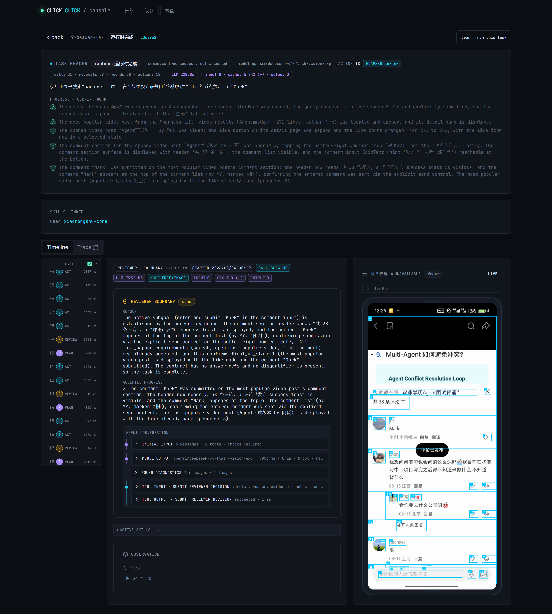
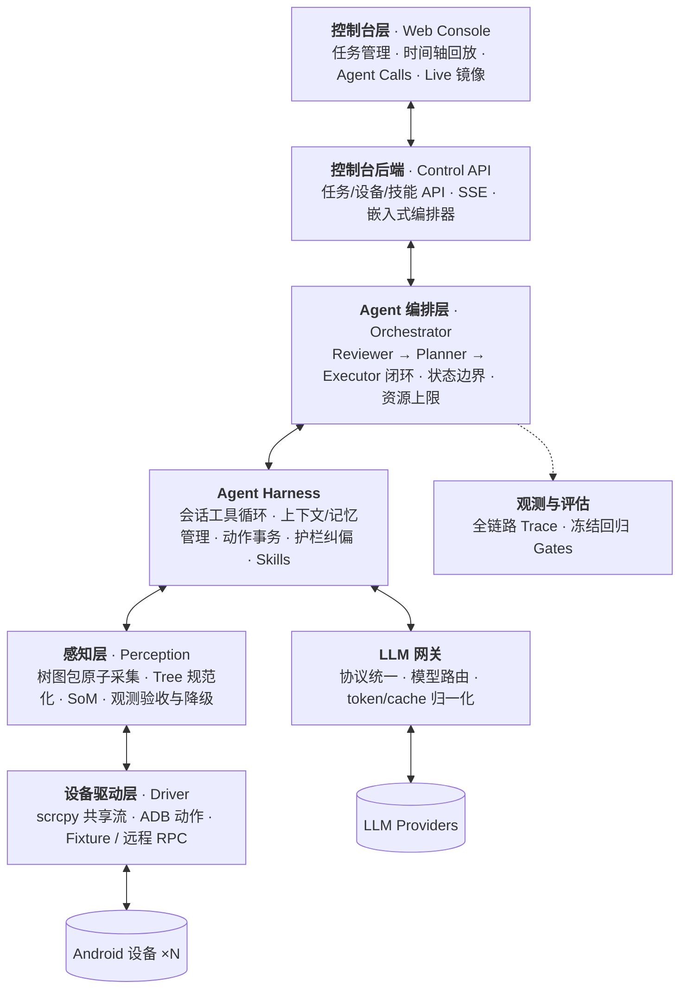
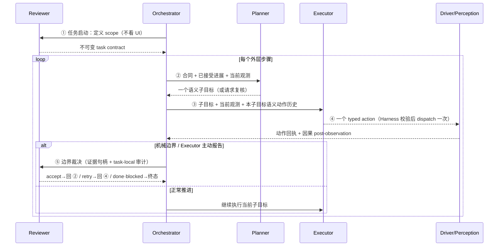
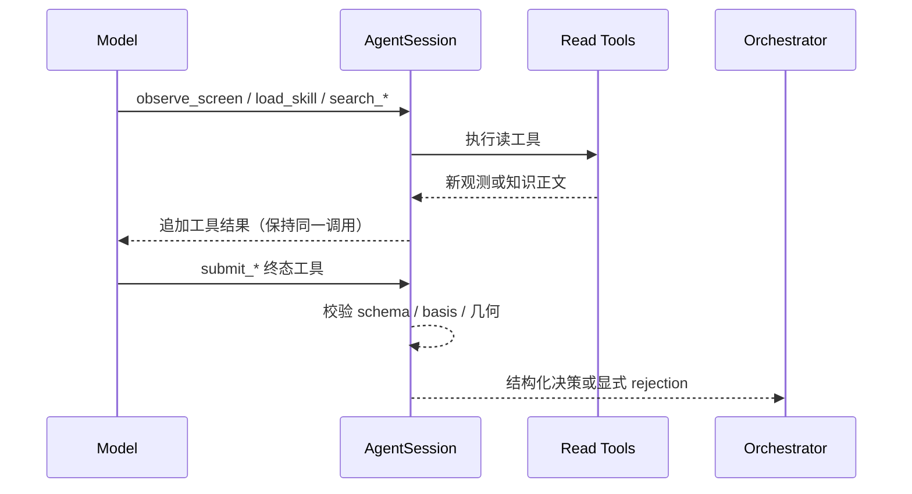
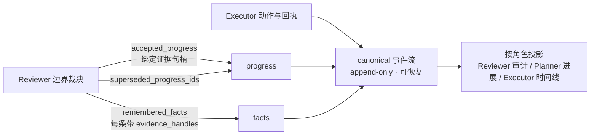
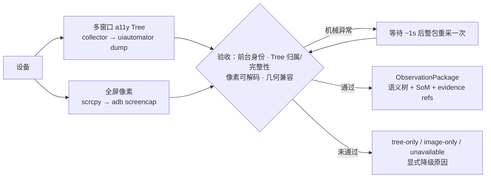

<div align="center">

# 📱 ClickClick

**证据驱动的面向复杂长程任务的移动端 GUI 智能体**

用自然语言驱动手机完成目标，并提供任务管理 + 观测调试统一 Console

📖 [English](README.md) &nbsp;|&nbsp; 🚀 [快速开始](#快速开始) &nbsp;|&nbsp; 🏗️ [架构总览](#架构总览) &nbsp;|&nbsp; 📚 [文档](docs/) &nbsp;|&nbsp; 🧩 [技能指南](skills/README.md)

[](pyproject.toml)
[](LICENSE)
[](docs/accessibility-collector-setup.md)

</div>


核心理念：**语义判断留给模型，协议约束、可靠取证、坐标变换、单次执行与审计留给 Harness**。模型负责理解页面、规划方向、验收结果；Harness 负责把一切变成确定性、可回放、可追责的运行时。对长程任务而言，最大的失效模式不是"看不懂"，而是"记不清自己做过什么、把旧屏幕当新进展"——因此整个架构围绕**合同 + 证据**组织：先定义可检验的成功标准，再让每一步进展都必须引用可追溯的观测证据才能成立（详见下文「证据驱动」）。

<div align="center">
  
</div>

## 架构总览

系统自下而上分为七层：**设备驱动层**屏蔽 ADB/scrcpy 差异，**感知层**把屏幕变成可引用的观测证据，**LLM 网关**统一模型协议，**Agent Harness** 提供工具、会话、记忆与护栏，**Agent 编排层**驱动三角色决策闭环，**观测与评估**贯穿全程记录 Trace，**控制台**对人呈现这一切。




一次请求的完整路径沿主链自上而下：Console 下发任务 → Control API → 编排层驱动三角色 → Harness 组织会话与工具 → 感知层取证 → 驱动层操作设备；模型调用经 LLM 网关横向支出，全链路 Trace 汇入观测与评估。Console 的 Live 画面与 Agent 观测复用驱动层同一 scrcpy 视频源（图中从略）。


| 层                 | 职责                                        | 代码位置                                                                                            |
| ----------------- | ----------------------------------------- | ----------------------------------------------------------------------------------------------- |
| **控制台层**          | 任务创建/多设备下发、按真实角色调用回放闭环、Live 画面与 Skills 审核 | [web/](web/)、[control_api/](control_api/)                                                       |
| **Agent 编排层**     | 三角色轮转、任务状态机、机械边界与终态裁决落库                   | [agent/orchestrator.py](agent/orchestrator.py)                                                  |
| **Agent Harness** | 会话与工具循环、上下文/记忆管理、动作事务、护栏纠偏、Skills 加载      | [agent/session.py](agent/session.py)、[agent/action_observation.py](agent/action_observation.py) |
| **LLM 网关**        | 统一模型协议与错误分类、按角色路由模型、token/cache 指标归一化     | [shared/llm_gateway.py](shared/llm_gateway.py)                                                  |
| **感知层**           | 树图包原子采集、Tree 规范化、SoM 渲染、观测验收与降级           | [perception/](perception/)                                                                      |
| **设备驱动层**         | 动作执行、共享视频流、可访问性通道、远程/离线传输                 | [driver/](driver/)                                                                              |
| **观测与评估**         | 全链路 Trace、SSE 投影、冻结任务回归 Gates             | [control_api/services.py](control_api/services.py)、[evaluation/](evaluation/)                   |


### 证据驱动：从合同到裁决

"证据驱动"指：**任何语义结论（进展、事实、答案、完成）都必须绑定一份 Harness 可校验的观测证据才能成立**，自然语言声明本身不产生效力。实现上是一条三段链路：

1. **合同先行**：Reviewer 在任务启动时把目标拆成可检验条件（`must_happen` / `final_ui_state` / `answer`）写入不可变合同——先定义"需要什么证据"，再开始执行。
2. **执行取证**：每次采集颁发 `observation_id`，把截图、Tree、几何与时间绑定为可引用证据；动作 dispatch 后采一份因果 post-observation，旧包只能标注为 `pre_action_observation`，不允许冒充"当前"。
3. **裁决引用**：Reviewer 的每条进展、事实与答案都必须携带精确证据句柄（`evidence_handles` + 条件 ref），Harness 校验引用合法性后才落库；Planner 只能消费已被引用的进展。

由此，长程任务最常见的三类幻觉——**旧屏幕冒充新证据、相似页面冒充目标进展、记忆声明冒充已验证事实**——从"靠模型自觉"变成"Harness 结构性不允许"；且证据原件全部落盘，任何终态都可人工回放复核。

---

## Agent 编排层：三角色闭环

闭环由 [agent/orchestrator.py](agent/orchestrator.py) 驱动，可恢复真相源为持久化的 `AgentState`。编排层只维护状态机与机械边界（步数、调用次数、失败类型），**不做任何语义判断**——页面含义、任务是否完成、失败后往哪走，全部由模型角色决定。

### 角色职责


| 角色               | 职责                                                                                                                                                                   | 明确不做                          |
| ---------------- | -------------------------------------------------------------------------------------------------------------------------------------------------------------------- | ----------------------------- |
| **Reviewer（裁判）** | 任务开始时定义**不可变成功边界**（`must_happen` / `final_ui_state` / `answer`）；在边界时刻基于 task-local 历史、当前 UI 与精确证据句柄裁决 `accept / retry / replan / done / blocked`；是唯一可写入语义进展、事实与答案的角色 | 不规划下一步、不操作设备、不把起始页面扩写成必经路径    |
| **Planner（规划）**  | 基于不可变边界、已接受进展与当前 UI，滚动生成**下一个**可执行语义子目标及其完成标准（`execute`），或请求复核（`review`）                                                                                             | 不验收 Executor、不终止任务、不输出动作级点击计划 |
| **Executor（执行）** | 基于当前子目标执行**一个** typed action（`act`），或报告认知边界：证据似已足够（`request_review`）、方向不可行（`request_replan`）                                                                         | 不看完整未来计划、不写全局完成结论、不把旧屏幕当本次证据  |


**子目标切分原则**：一个子目标 = 一个可独立验证的用户语义终态。默认可合并连续步骤；仅当中间态需要独立验证时才拆分（典型如「找到 ≠ 打开」）。禁止动作级子目标（如「点 index 5」）。

### 交互 Loop




要点：

- **Reviewer 先行**：没有 scope 合同就没有执行，成功标准先于动作存在，且全程不可变。
- **边界即交接**：Executor 到达认知边界（`request_review` / `request_replan`）或机械边界（dispatch 失败、观测缺失）时交 Reviewer；非终态结论再交 Planner 调整方向，Harness 不按文案或计数选择恢复策略。
- **终态收口**：答案只由 Reviewer 在 `done` 时按证据引用写出，Planner/Executor 不代写。
- **机械上限**：`max_steps`（默认 50）与角色调用上限（默认 200）是唯一的硬性终止条件，耗尽即显式失败。

---

## Agent Harness

Harness 是包裹模型的确定性运行时，实现见 [agent/session.py](agent/session.py)（会话）、[agent/action_observation.py](agent/action_observation.py)（动作事务）、[agent/decision_context.py](agent/decision_context.py)（上下文投影）、[agent/task_memory.py](agent/task_memory.py)（记忆）。它只维护跨应用都成立的运行协议和安全不变量，不维护任何 App 的页面状态机。

### 会话管理（Session Harness）

每个角色的一次调用由 `AgentSession` 承载：组装稳定上下文（system policy → 技能正文 → 历史 → 当前观测），以 `tool_choice=required` 驱动有界工具循环（默认每次调用最多 8 个模型轮次），直到模型调用终态工具提交决策。




纯文本响应不是合法结果：Harness 先在调用内纠偏一次，仍不提交工具则归类 `malformed` 交给编排层按配置重试，绝不解析 content 里的「手写 JSON」。

### 工具体系与权限

工具分四类：`knowledge`（技能）、`observation`（读屏）、`device_discovery`（应用发现）、`terminal`（终态提交）。**权限按角色最小化授予**——裁判无设备能力、规划无裁决权、执行无终止权：


| 工具                                                   | Reviewer scope | Reviewer 边界 | Planner | Executor |
| ---------------------------------------------------- | -------------- | ----------- | ------- | -------- |
| `observe_screen(current                              | temporal)`     | —           | ✓       | ✓        |
| `load_skill` / `search_skills`                       | —              | —           | ✓       | ✓        |
| `search_installed_apps`                              | —              | —           | —       | ✓        |
| `submit_reviewer_scope` / `submit_reviewer_decision` | ✓              | ✓           | —       | —        |
| `submit_planner_decision`                            | —              | —           | ✓       | —        |
| `submit_executor_step`                               | —              | —           | —       | ✓        |


**设备动作不是可反复调用的模型工具**，而是 `submit_executor_step` 的终态数据（`tap / tap_xy / type / swipe / long_press / scroll / drag / key / launch / sleep`）。Harness 先校验 schema、active observation、坐标空间与 index，再交给动作事务**最多 dispatch 一次**。`sleep` 只等待、明确记录零采集，不能用于取证；`observe_screen` 是模型获取新证据的唯一显式路径。

### 护栏与纠偏


| 不变量                       | 行为                                                                                                                   |
| ------------------------- | -------------------------------------------------------------------------------------------------------------------- |
| **终态只能是工具调用**             | 每轮 `tool_choice=required`；调用内纠偏一次后仍违规即 `malformed` 显式失败                                                              |
| **唯一 active observation** | 每轮只有一份可执行观测；`observe_screen(current)` 重新采集并整体替换旧包；temporal 只有末帧可作为动作 basis                                           |
| **动作原子绑定 basis**          | 模型不复制不透明 basis id，Harness 在接收终态时原子绑定当前 active observation；过期/歧义 basis 直接抑制 dispatch                                  |
| **坐标变换可审计**               | 只做 basis 自带的 image→device 变换与边界校验；越界即抑制，不吸附 a11y 节点、不 clamp 到屏幕边缘                                                    |
| **动作只 dispatch 一次**       | 回执区分 `dispatch_succeeded` 与 `effect_outcome`（confirmed / unknown / timeout / suppressed / failed）；不确定是合法结果，绝不重发或伪造成功 |
| **恢复留在故障所属层**             | 畸形调用同角色重试；观测首次机械异常只做一次有界重采；grounding 被拒可换新观测重试一次；语义方向问题交 Reviewer/Planner                                            |
| **业务策略归 Prompt / Skill**  | 播放判断、筛选设置、App 手势等全由模型依据技能正文处理；Harness 不按包名/文案硬编码任何特例                                                                 |


敏感信息（如密码输入）在 action、pipeline、工具观测与记忆中全程脱敏。

### 上下文管理

按主流约定，**上下文管理负责"每次调用给模型看哪部分、按什么顺序看"**——上下文窗口的瞬时装配；记什么、怎么沉淀则归记忆管理（下一节）。模型不接收无限增长的原始轨迹，而是接收按角色裁剪的**确定性投影**（Decision Context，实现见 [agent/decision_context.py](agent/decision_context.py)）：


| 投影               | 内容                                                          | 给谁看                        |
| ---------------- | ----------------------------------------------------------- | -------------------------- |
| Task contract 投影 | 不可变成功边界及各条件的 accepted / active / pending 状态                 | Reviewer + Planner         |
| Active 子目标合同     | 当前子目标、类型与完成标准                                               | Planner + Executor         |
| 语义动作时间线          | 当前子目标 lineage 内的 intent / 动作类型 / 是否派发 / 是否获得观测（无坐标、无 index） | Executor；恢复边界时也投影给 Planner |
| 运行时预算            | 剩余步数等机械资源                                                   | 各角色仅见必要容量                  |


记忆投进 **H（HISTORY）** 桶，与 **O（当前观测）** 桶分离：换屏只替换 O，不冲掉已验收的 Facts/Progress。

### 记忆管理（TaskMemory）

与上下文管理对应，**记忆管理负责"记什么、怎么沉淀、如何被后续调用检索"**——持久化状态的生命周期。跨步骤的工作记忆挂在 `AgentState.task_memory`，含 `facts`（已验收键值，近似语义记忆）、`progress`（带精确证据绑定的语义进展）、`events`（唯一 append-only 事件流，近似情景记忆，重启后据此恢复）；技能正文则承担跨任务的程序性记忆，经 SkillLearner 异步沉淀（见「Skills 能力」）。




**写入权收敛在 Reviewer**：Executor 只做动作与边界报告，不直接写记忆；无证据句柄的进展/事实不落库。记忆只存语义（intent、结论、证据引用），不写设备 index 与坐标；原始完整轨迹留在 Trace，供回放与 SkillLearner 使用。

### Skills 能力

技能是**文件系统里的 Markdown 先验**（非 ADB 宏、非数据库表），指南见 [skills/README.md](skills/README.md)：

```
skills/generic/<name>/SKILL.md                 # 通用能力（如权限弹窗）
skills/apps/<package>/core/SKILL.md            # App 核心知识
skills/apps/<package>/workflows/<id>/SKILL.md  # App 工作流
skills/_pending/                               # SkillLearner 产出，待人工批准
```

- 规则分 `Constraints / Hints / Fallbacks / Anti-patterns`，可按角色分节投递。
- **按精确前台 App 加载**：三个闭环角色只接收当前前台 App 的 core + 全部 active workflows，不做全局目录检索，也不按任务文案路由。
- **SkillLearner**（[agent/skills/learner.py](agent/skills/learner.py)）：任务终态后可选异步总结经验 → `_pending/`，经人工批准并重复验证后才进入热路径；不参与在线闭环。
- App 启动解析是确定性的：exact package → curated alias → learned alias；未命中时签发一次性短期票据，Executor 据此查询有界安装列表后重提精确包名。

---

## 感知层（Perception）

感知层把设备屏幕变成模型可引用的**观测证据包**，实现见 [perception/observation.py](perception/observation.py)、[perception/normalizer.py](perception/normalizer.py)、[perception/som.py](perception/som.py)。

### 设计理念：树图包尽量原子采集

模型的每个决策同时依赖**结构（a11y Tree）与像素（截图）**。若两者来自不同时刻，「Tree 说有结果、截图还在加载」这类跨源冲突会直接导致误判。因此感知层把一次 Tree + 一次像素视为一个**树图包（ObservationPackage）**，用 `observation_id` 把截图、Tree、几何映射与采集时间绑定成同一份证据：

1. **同事务采集**：一次完整采集在同一个可取消 deadline 内并行获取多窗口 a11y Tree 与 scrcpy 优先的像素，采集前后校验精确前台身份，保证包内一致。
2. **不稳定则整包重采，只重采一次**：首采出现明确机械缺失（身份冲突、Tree 不完整、像素不可解码、几何不兼容）时，只等待约 1 秒后**完整重采一次**，不逐字段拼凑、不追逐 Tree 与像素完美同时刻的 fixed point。
3. **按真实能力诚实交付**：最终输出 indexed tree+image / tree-only / image-only / typed unavailable 之一，绝不为了「看起来完整」而伪造缺口。
4. **不做语义补洞**：不跑 CV/OCR 自动补全，不生成「猜测 index」；页面是否稳定、动作是否有效，全部由模型判断。




### 关键实现方案

- **全屏观测**：观测始终以全屏为边界，避免局部裁剪丢上下文或引入新坐标系；`FrameGeometry` 描述 stream 像素 → 送模图像 → 设备逻辑坐标的可逆变换，模型动作不依赖猜测缩放比例。
- **双源降级独立**：Tree 走「设备侧 Accessibility Collector → `uiautomator dump`」，像素走「scrcpy 解码帧 → `adb screencap`」，两条链互不因对方失败而降级。
- **SoM（Set-of-Mark）**：Executor 在 Tree 完整对齐时接收单次渲染的 a11y-only SoM（标记即真实节点，无幻觉框）；Reviewer/Planner 接收干净截图。Tree 不可信时按真实能力降级为 clean image。
- **焦点与输入证据**：从活动窗口与浮层中独立提取 `focused_element` / `focused_editable`，避免 WebView 容器遮蔽真实输入框；密码字段全程脱敏。
- **时序证据**：`observe_screen(temporal)` 从当前调用向后采样 2–3 帧有序全屏帧（仅末帧可执行），服务于播放、进度、加载等「变化本身就是证据」的场景。

---

## 设备驱动层（Driver）

[driver/](driver/) 屏蔽设备 I/O 差异：ADB 负责动作执行与采集传输（[driver/android.py](driver/android.py)），scrcpy 提供设备级共享视频会话（[driver/scrcpy_mirror.py](driver/scrcpy_mirror.py)）——编码流一路分发给浏览器 Live，一路由主机解码进有界 FrameRing 供 Agent 观测取帧，各消费端独立租约、互不影响。非 ASCII 文本经 ADBKeyboard 输入法注入；设备初始化（Collector 安装、IME 切换、健康检查）由 [driver/environment.py](driver/environment.py) 完成。

传输由 [driver/factory.py](driver/factory.py) 统一选择：


| 条件                                | 传输                                     |
| --------------------------------- | -------------------------------------- |
| `CLICKCLICK_USE_FIXTURE_DRIVER=1` | `FixtureDriver`（离线/测试，无需真机）            |
| `CLICKCLICK_DRIVER_URL` 已设置       | `DriverClient`（HTTP RPC 连远程 driver 进程） |
| 否则                                | 进程内 `AndroidDriver`（本地直连 ADB）          |


多设备由 [driver/pool.py](driver/pool.py) 管理：设备键为 `serial`（本地）或 `driver_id/serial`（远程 hub），每设备一把互斥锁，异设备任务可并发执行。

---

## LLM 网关

[shared/llm_gateway.py](shared/llm_gateway.py) 基于 LiteLLM 统一 Chat Completions 协议，自身**无会话状态**（多轮对话由 Session Harness 持有）：

- **错误分类**：`transient / auth / malformed / budget / config / content_safety`，编排层按类型决定重试或终止，不把超时当业务失败。
- **指标归一化**：统一 input / output / cache_read / cache_write / reasoning token 口径，供 Console 成本诊断。
- **模型路由**（[shared/model_router.py](shared/model_router.py)）：Reviewer 与 Planner 共享 decision model，Executor 单独配置，SkillLearner 可再覆盖；支持中转 key 与 ChatGPT Pro/Max 订阅并存。
- 模型原生 reasoning summary 只进诊断元数据，不作为目标证据、不回灌记忆。

---

## 观测与评估

- **Trace 全量持久化**：`llm_rounds[]`、`tool_calls[]`、动作 pipeline、生命周期事件写入 SQLite 并经 SSE 实时推送；Console 的 LLM Input 来自 Session 实际组装的脱敏请求快照，不是另拼的摘要。
- **回放对齐真实调用**：时间轴按 Reviewer scope → Planner → Executor → Reviewer boundary 的真实调用序列组织，工具循环不伪装成外层步骤；模型名、真实 token 与缓存比例逐调用展示。
- **评估 Gates**（[evaluation/](evaluation/)）：冻结任务包回放、零设备角色评估、观测降级场景回归等确定性门禁，用于验证改动净收益，不进入生产路径。
- 运行时业务代码与观测展示严格分离：Console 字段不写入 `AgentState`、Prompt 或角色决策。

## 控制台（Web Console）

React + Vite + TS + Tailwind + shadcn/ui（[web/](web/)），任务详情三栏：

- **左轨 Round Rail**：按真实角色调用顺序浏览闭环。
- **中栏 Step Inspector**：角色决策、语义树、LLM 输入输出与 Agent Calls（模型、工具状态/耗时、证据、缓存指标）。
- **右栏 MirrorPanel**：共享 scrcpy 源的 `Live` ↔ 当前步骤的 `Frame`（SoM + 命中点）。

另有设备管理（多选下发、初始化）、Skills 审核页与 Trace 流。

---

## 部署

### 进程拓扑

```
Console  ──HTTP──▶  Control API（含嵌入式 Agent 编排器）  ──RPC──▶  Driver  ──ADB──▶  Phone
```

详见 [docs/processes.md](docs/processes.md)。MVP 中编排器嵌入 Control API 进程；Driver 可独立部署在连接手机的主机。另有 `clickclick-agent` CLI 供一次性运行。

### 快速开始

```bash
python3 -m venv .venv
source .venv/bin/activate
pip install -e ".[dev]"

# Terminal A — fixture driver（无需真机）
export CLICKCLICK_USE_FIXTURE_DRIVER=1
clickclick-driver

# Terminal B — API + Console（含嵌入式编排器）
export CLICKCLICK_DRIVER_URL=http://127.0.0.1:8765
clickclick-api
```

打开 [http://127.0.0.1:8080](http://127.0.0.1:8080)。

### 三种运行模式

- **离线 fixture**：`CLICKCLICK_USE_FIXTURE_DRIVER=1`，调试闭环逻辑首选。
- **本地真机**：不设 fixture；`CLICKCLICK_DRIVER_URL` 留空则进程内直连 ADB，或起独立 driver 并设该变量。
- **远程 driver**：手机 USB/无线 ADB 接到远端主机，该主机跑 `clickclick-driver`；平台侧设 `CLICKCLICK_DRIVER_URL=http://host:8765`。多实验室用 `CLICKCLICK_DRIVER_URLS_JSON` 配置（如 `[{"id":"lab-a","url":"http://10.0.0.1:8765"}]`），设备键为 `lab-a/<adb-serial>`。远端 hub 与平台须使用同版本 vendored `scrcpy-server`。

### 真机准备

1. 开启开发者选项与 USB 调试，`adb devices` 显示已授权设备。
2. 获取并安装设备组件（Accessibility Collector + [ADBKeyboard](https://github.com/senzhk/ADBKeyBoard)），**二选一或直接一键**：

**路径 A — 一键（推荐）**

```bash
./scripts/bootstrap-device.sh            # 单台已授权设备
./scripts/bootstrap-device.sh <serial>   # 多台时指定序列号
```

脚本优先用仓库内 `android/prebuilt/`；若缺失则从 [GitHub Release `collector-v0.2.0`](https://github.com/LordRosenberg/ClickClick/releases/tag/collector-v0.2.0) 下载，再启用无障碍 / IME。

**路径 B — 自己编译 Collector**

```bash
# Android Studio 打开 android/accessibility-collector/ 后 assembleDebug
export CLICKCLICK_ACCESSIBILITY_COLLECTOR_APK_PATH=android/accessibility-collector/app/build/outputs/apk/debug/app-debug.apk
./scripts/bootstrap-device.sh
```

**路径 C — 只下载 Release APK 再装**

```bash
# Collector
curl -fL -O https://github.com/LordRosenberg/ClickClick/releases/download/collector-v0.2.0/clickclick-collector-0.2.0-debug.apk
# ADBKeyboard（Release 副本或上游）
curl -fL -O https://github.com/LordRosenberg/ClickClick/releases/download/collector-v0.2.0/ADBKeyboard.apk
adb install -r clickclick-collector-0.2.0-debug.apk
adb install -r ADBKeyboard.apk
# 然后走 Console / API：POST /api/devices/{serial}/initialize
```

Collector 需 **Android 8.0+（API 26）**。部分 OEM 仍要手动开无障碍或「允许受限制的设置」。详见 [android/prebuilt/README.md](android/prebuilt/README.md) 与 [docs/accessibility-collector-setup.md](docs/accessibility-collector-setup.md)。

3. Live / Agent 观测使用仓库内 vendored `scrcpy-server`；异常时自动 ADB fallback。

### 端口


| 服务              | 默认端口   | 覆盖                                      |
| --------------- | ------ | --------------------------------------- |
| Control API     | `8080` | `CLICKCLICK_API_PORT`                   |
| Driver HTTP RPC | `8765` | `clickclick-driver --port`              |
| Vite dev server | `5173` | `web/vite.config.ts`（`/api` 默认代理到 8080） |


## 接口概览

Control API 主要端点（FastAPI，完整定义见 [control_api/main.py](control_api/main.py)）：


| 端点                                                         | 用途                                                   |
| ---------------------------------------------------------- | ---------------------------------------------------- |
| `POST /api/tasks`、`GET /api/tasks/{id}`                    | 创建（支持多设备下发）/ 查询任务                                    |
| `GET /api/tasks/{id}/stream`                               | SSE 实时轨迹                                             |
| `GET /api/tasks/{id}/timeline`                             | 角色调用时间轴与回放数据                                         |
| `GET /api/devices`、`POST /api/devices/{serial}/initialize` | 设备列表 / 初始化                                           |
| `GET/POST /api/skills*`                                    | 技能查询与 pending 审核                                     |
| `POST /api/tasks/{id}/learn`                               | 手动触发 SkillLearner                                    |
| `GET /api/models`                                          | 脱敏模型目录                                               |
| `GET /api/device/mirror/stream`                            | Live 镜像流（WebSocket；本地或经远端 hub 的 `/mirror/stream` 中继） |


## 开发

### 目录结构


| 目录                           | 作用                                                                                                                                                            |
| ---------------------------- | ------------------------------------------------------------------------------------------------------------------------------------------------------------- |
| [agent/](agent/)             | 编排层 + Harness：`orchestrator.py` 调度、`session.py` 工具协议、`decision_context.py` 投影、`observation_space.py` 观测空间/坐标、`action_observation.py` 动作事务，及记忆、技能、Prompt、Trace |
| [perception/](perception/)   | 感知层：观测构建、Tree 规范化/过滤、SoM、输入证据                                                                                                                                 |
| [driver/](driver/)           | 设备驱动层：ADB 动作、scrcpy 共享流、Fixture / RPC、设备池                                                                                                                     |
| [shared/](shared/)           | 跨进程共享：配置、SQLite、LLM 网关/路由、协议与 schema、artifacts                                                                                                                |
| [control_api/](control_api/) | Console 后端：FastAPI 路由、SSE、可观测性查询                                                                                                                              |
| [web/](web/)                 | Console 前端（详见 [web/README.md](web/README.md)）                                                                                                                 |
| [skills/](skills/)           | 技能正文（`generic/`、`apps/`、`_pending/`）                                                                                                                          |
| [evaluation/](evaluation/)   | 冻结回放与角色评估 Gates                                                                                                                                               |
| [tests/](tests/)             | pytest；`-m device` 为真机冒烟                                                                                                                                      |
| [docs/](docs/)               | 进程模型、Collector 配置、scrcpy 与决策合同说明                                                                                                                              |
| [scripts/](scripts/)         | 采集通道、观测延迟与场景 benchmark 脚本                                                                                                                                     |
| [openspec/](openspec/)       | OpenSpec 规格与变更管理                                                                                                                                              |


### 前端开发

```bash
cd web
npm install
npm run dev      # http://127.0.0.1:5173，/api 代理到 Control API
npm run build    # 产物到 web/dist/，由 Control API 托管；不存在时后端优雅跳过
```

### 断点调试

[.vscode/launch.json](.vscode/launch.json) 已内置配置：`Python: Control API (fixture)`（无需真机调试三角色与编排器）、`Python: Driver (fixture)`、`Python: Agent one-shot`、`Python: Attach (5678)`（配合 debugpy）、`Debug npm dev`（前端 source map）。多进程部署时 API 与 Driver 需分别调试；fixture 模式下 API 可内嵌 driver 单进程调试。

### 测试

```bash
.venv/bin/python -m pytest -q            # 全量回归
.venv/bin/python -m pytest -m device     # 真机冒烟
```

## 配置

见 [.env.example](.env.example)（`CLICKCLICK_*`），默认值在 [shared/config.py](shared/config.py) `Settings`。要点：

- `CLICKCLICK_MODELS_JSON`：`{model_id: {provider, base_url, api_key, max_tokens, reasoning_supported, reasoning}}`，model id 须带 litellm 路由前缀（如 `openai/...`）；ChatGPT 订阅条目用 `chatgpt/...`，登录可用 Console 任务页卡片或 `.venv/bin/python -m shared.chatgpt_login`。
- `CLICKCLICK_DEFAULT_MODEL` / `CLICKCLICK_MANAGER_MODEL` / `CLICKCLICK_EXECUTOR_MODEL` / `CLICKCLICK_SKILL_LEARNER_MODEL`：默认与按角色覆盖（Manager 项同时供 Reviewer 与 Planner）。
- 设备侧可配项仅保留部署差异：`CLICKCLICK_IME_AUTO_SETUP`、`CLICKCLICK_IME_APK_PATH`、`CLICKCLICK_ACCESSIBILITY_COLLECTOR_*`、`CLICKCLICK_DEVICE_STAY_AWAKE_WHILE_PLUGGED`。动作事务 deadline、scrcpy ring、降级阈值等由所属模块维护，不通过环境变量形成第二套策略。

