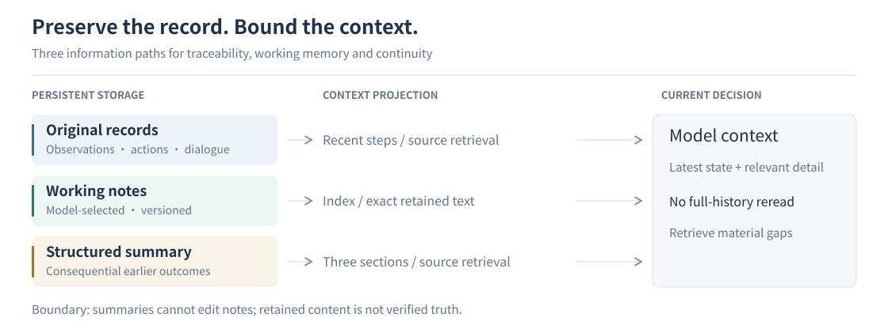

# System architecture

[README](../README.md) · [中文](architecture.zh-CN.md) · [Technical overview](reliability-design.md) · [Design decisions](design-decisions.md)

This guide describes **module boundaries, interfaces and task execution flow**, with links to detailed subsystem designs. The [technical overview](reliability-design.md) explains the goals behind the core mechanisms.

## What harness means here

The **agent harness** is the runtime surrounding model inference: it builds requests, manages role transitions, selects skills and history, validates tool submissions, dispatches actions and returns feedback. **Session** is the durable task record. **Device tools** interact with the phone and construct observations.

| Module | Responsibility | Main interface |
| --- | --- | --- |
| Model | Interpret the task, choose goals and actions, judge evidence. | Role-specific model requests and structured submissions. |
| Agent harness | Coordinate planning, context, skills, tools, budgets and feedback. | Task loop, role tool sessions and action validation. |
| Session | Store events, observations, dialogue, note versions and artifacts. | TaskStore backed by SQLite and artifact files. |
| Device tools | Capture UI state and execute Android operations. | Driver actions and ObservationPackage results. |
| Console / Control API | Manage tasks/devices and expose execution state. | HTTP APIs, SSE, Timeline and live mirror. |
| Evaluation | Initialize controlled tasks and score outcomes independently. | Benchmark adapter and external task predicates. |

These are logical boundaries. Control API hosts the harness; device tools can run locally or on a remote Driver host. A role's bounded tool session is distinct from the persistent Session. The storage model includes both append-only records and mutable task snapshots.

## Task lifecycle

1. Console or a caller submits an instruction, model configuration and target device.
2. The runtime prepares the device, captures an observation and restores task records.
3. Planner selects a current stage and relevant skills.
4. Executor reads the current stage, memory and observation, then submits an action or a stage transition.
5. The harness validates the submission, executes accepted actions and stores receipts and resulting evidence.
6. Execution continues, returns to planning, or requests independent review. Task termination preserves the final state and trace.

The original instruction remains authoritative as stages change. Models interpret requirements; deterministic checks validate schemas, references, stage identity, supported input preconditions and limits.

## Roles and transitions

`Settings.agent_architecture` selects the policy. `plan_executor` is the default; `plan_reviewer` requires final review.

| Role / submission | Default `plan_executor` behavior |
| --- | --- |
| Planner `execute` | Persist the revised current stage and invoke Executor. |
| Planner `complete` | Complete the task if submission checks and task limits permit it. |
| Planner `review` | Invoke Reviewer with the stated conflict and evidence. |
| Executor `act` | Validate and dispatch a typed action, then record feedback and continue. |
| Executor `advance` | Complete the identified stage and return to Planner. |
| Executor `replan` | Return the observed mismatch to Planner. |
| Executor `finish` | Ask Planner for the task-level verdict. |
| Executor `review` | Invoke Reviewer even in two-role mode. |
| Reviewer `complete` | Complete the task. |
| Reviewer `execute` / `replan` | Return to execution or planning according to the verdict and current stage. |
| Planner or Reviewer `inconclusive` | End without claiming success. |

In `plan_reviewer`, Planner completion and Executor `finish` route to Reviewer. This policy does not mean that every device action is reviewed. Explicit `review` remains available in either mode.

On-demand review is chosen inside an existing model decision, not by a separate review-selection model. Prompts distinguish a known missing device check from a dispute needing independent judgment. Repeating review with the same observation, plan revision, execution count and note versions fails explicitly instead of looping indefinitely.

Source: [runtime selection](../agent/runtime.py), [orchestration](../agent/revisable/orchestrator.py), [Planner/Reviewer schemas](../shared/revisable.py), [Executor submission](../agent/revisable/session.py).

## A device interaction

An observation package has an identity, pixels, UI structure, geometry and capture metadata. Executor must reference the current observation when acting; retrieved historical images cannot replace that action basis.

For supported local indexed taps, a private handle binds the selected index to the observed native node. The driver refreshes and checks the retained node before a single native click. Invalid or uncertain native results return feedback without silently reusing old coordinates. Other actions retain their documented coordinate paths.

Supported targeted text replacement resolves a field, establishes and checks focus, writes the text and verifies readback. Receipts separate dispatch, input and observed effects. An input value is not by itself proof that the app saved a record.

Skill-authorized compound actions run a closed sequence through the same primitive transactions. Intermediate observations are stored as historical evidence; the final observation supplies the next actionable state. Physical subactions and submitted action units are separately recorded.

## Observation path

The shared scrcpy stream serves Console Live and agent pixels. PyAV decodes frames; Accessibility Collector supplies nodes, windows and available events. Perception builds the normalized UI and Set-of-Mark view. ADB screencap is the fallback pixel source.

Freshness checks use capture request boundaries and window generations. Bounded resampling handles transitions; usable pixels can remain available when structure is missing. Pixels and accessibility state are asynchronous, so this is not an atomic snapshot of every animated interface. See [capture design](design-decisions.md#scrcpy-collector-and-python).

## Context, memory and skills

Memory has three layers: original records preserve sources, versioned notes retain information needed later, and process summaries connect earlier execution history. Models receive a bounded context and retrieve missing details by source.

Compaction keeps the newest two execution steps; notes, unresolved questions and measurements are restored separately. Summaries cannot edit notes, and retained content is not verified truth. See [Memory and context design](memory-and-context.md) for lifecycles, fields, budgets and risks.

Planner selects stage skills from the catalog. Device profiles filter system-specific guidance; target and observed foreground identities determine applicable app knowledge. Role sections tailor the delivered body, with skill IDs, versions and content hashes recorded. App-owned compound recipes additionally require matching active stage and foreground scope. See the [skill authoring guide](../skills/README.md).

## Operational boundaries

Cancellation and task limits stop further work at runtime boundaries. A receipt identifies what the device path reported; models and external evaluators determine semantic success. Persistent history supports inspection and continuation but does not provide arbitrary crash recovery, transactional rollback or exactly-once device input. Deployment access and Android authorization are separate from tool validity checks.

## Module design guides

| Module | Design and documentation | Coverage |
| --- | --- | --- |
| Task orchestration and roles | [Roles and transitions](#roles-and-transitions), [Role policy](design-decisions.md#role-policy) | Stage progression, replanning, on-demand review and completion |
| Memory and context | [Memory and context design](memory-and-context.md) | Notes, structured summaries, source retrieval and storage |
| Skill management | [Skills guide](../skills/README.md), [Role-specific delivery](design-decisions.md#role-specific-skills) | Skill organization, app/device scope and role delivery |
| Observation and mirroring | [scrcpy observation](scrcpy-observation.md), [Collector setup](accessibility-collector-setup.md) | Shared video, frame freshness, UI structure and fallback |
| Actions and input | [Native node binding](design-decisions.md#native-node-binding), [Targeted text replacement](design-decisions.md#targeted-text-replacement) | Target validation, focus, replacement and readback |
| Model integration | [Model routing](deployment.md#model-routing), [Prompt-cache continuity](design-decisions.md#prompt-cache-continuity) | Model configuration, role routing and request-context reuse |
| Console and observability | [Observability design](observability.md) | Event records, timelines, model calls and artifact inspection |
| Processes and device deployment | [Process topology](processes.md), [Deployment](deployment.md) | Local/remote Drivers, service boundaries and startup configuration |
| Evaluation integration | [Evaluation and reproduction](evaluation.md), [AndroidWorld adapter](androidworld-benchmark.md) | Task initialization, action accounting and independent scoring |

## Code map

| Boundary | Main implementation |
| --- | --- |
| Harness: runtime and role loop | [runtime.py](../agent/runtime.py), [revisable/orchestrator.py](../agent/revisable/orchestrator.py), [roles.py](../agent/revisable/roles.py) |
| Harness: tools and decisions | [session.py](../agent/session.py), [revisable/session.py](../agent/revisable/session.py), [revisable/tools.py](../agent/revisable/tools.py) |
| Harness: context and retrieval | [recall.py](../agent/revisable/recall.py), [context_projection.py](../agent/context_projection.py) |
| Harness: skill management | [agent/skills/](../agent/skills/), [pending.py](../agent/skills/pending.py); content in [skills/](../skills/) |
| Harness: action and input control | [action_observation.py](../agent/action_observation.py), [targeted_input.py](../agent/targeted_input.py) |
| Device tools: capture and device access | [scrcpy_mirror.py](../driver/scrcpy_mirror.py), [scrcpy_observation.py](../driver/scrcpy_observation.py), [accessibility.py](../driver/accessibility.py), [perception/](../perception/) |
| Harness: model routing | [llm_gateway.py](../shared/llm_gateway.py), [model_router.py](../shared/model_router.py) |
| Session: records and artifacts | [store.py](../agent/revisable/store.py), [db.py](../shared/db.py), [artifacts.py](../shared/artifacts.py) |
| Console and runtime hosting | [control_api/](../control_api/), [web/](../web/) |
| Evaluation integration | [AndroidWorld adapter](../agent/integrations/android_world.py), [evaluation guide](evaluation.md) |
