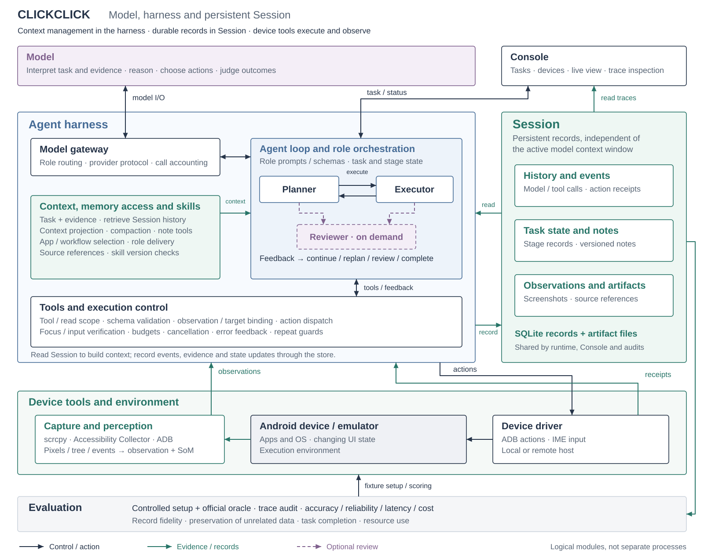

# 系统架构

[首页](../README.zh-CN.md) · [English](architecture.md) · [技术概览](reliability-design.zh-CN.md) · [设计取舍](design-decisions.zh-CN.md)

ClickClick 将任务推理、运行时控制、持久证据与 Android 交互分开组织。本文说明模块接口，以及一个任务如何通过这些模块完成执行。

## Harness 的定义

**Agent Harness** 是围绕模型推理的运行时：构造请求、管理角色转换、选择技能与历史、校验工具提交、派发动作并返回反馈。**Session** 是任务的持久记录。**设备工具** 操作手机并构建观测。

| 模块 | 职责 | 主要接口 |
| --- | --- | --- |
| 模型 | 理解任务、选择目标与动作、判断证据。 | 角色化模型请求与结构化提交。 |
| Agent Harness | 组织规划、上下文、技能、工具、预算和反馈。 | 任务循环、角色工具会话与动作校验。 |
| Session | 保存事件、观察、对话、笔记版本和产物。 | 基于 SQLite 与产物文件的 TaskStore。 |
| 设备工具 | 采集 UI 状态并执行 Android 操作。 | Driver 动作与 ObservationPackage。 |
| Console / Control API | 管理任务和设备，展示执行状态。 | HTTP API、SSE、Timeline 和实时投屏。 |
| 评测 | 初始化受控任务并独立检查结果。 | 基准适配器与外部成功判定函数。 |

这些是逻辑边界。Control API 承载 Harness；设备工具可以在本机运行，也可以部署到远程 Driver。角色的有界工具会话不同于持久 Session。存储同时包含追加记录与可更新的任务快照。

## 任务生命周期

1. Console 或调用方提交指令、模型配置和目标设备。
2. 运行时准备设备、采集观察并恢复任务记录。
3. Planner 选择当前阶段及所需技能。
4. Executor 读取阶段、记忆和当前观察，提交动作或阶段转换。
5. Harness 校验提交、执行动作，保存回执及结果证据。
6. 任务继续执行、返回规划或请求独立审核；结束时保留最终状态与轨迹。

阶段变化不改变原始指令的权威性。模型解释任务含义，确定性检查负责 schema、来源引用、阶段身份、受支持输入的前置条件及预算。

## 角色与转换

`Settings.agent_architecture` 选择策略。默认 `plan_executor`；`plan_reviewer` 要求最终审核。

| 角色／提交 | 默认 `plan_executor` 行为 |
| --- | --- |
| Planner `execute` | 保存修订后的当前阶段并调用 Executor。 |
| Planner `complete` | 提交校验和任务限制允许时完成任务。 |
| Planner `review` | 携带明确冲突与证据调用 Reviewer。 |
| Executor `act` | 校验并派发类型化动作，记录反馈后继续。 |
| Executor `advance` | 完成指定阶段并返回 Planner。 |
| Executor `replan` | 将观测到的不匹配返回 Planner。 |
| Executor `finish` | 请求 Planner 给出任务级结论。 |
| Executor `review` | 即使处于两角色模式，也可调用 Reviewer。 |
| Reviewer `complete` | 完成任务。 |
| Reviewer `execute` / `replan` | 根据结论和当前阶段返回执行或规划。 |
| Planner 或 Reviewer `inconclusive` | 结束任务，不声称成功。 |

在 `plan_reviewer` 中，Planner 的完成提交和 Executor 的 `finish` 会转给 Reviewer，并不意味着每个设备动作都被审核。两种模式都支持显式 `review`。

按需审核由已有模型决策选择，不额外调用一个审核选择模型。提示词区分“已知还缺一次设备检查”与“需要独立判断的争议”。观测、计划版本、执行次数和笔记版本均未变化时，重复审核会明确失败，避免无限循环。

来源：[运行时选择](../agent/runtime.py)、[编排](../agent/revisable/orchestrator.py)、[Planner／Reviewer schema](../shared/revisable.py)、[Executor 提交](../agent/revisable/session.py)。

## 一次设备交互

观测包包含身份、画面、UI 结构、几何信息与采集元数据。Executor 操作时必须引用当前观测；读取历史图片不会替换当前动作依据。

对于支持的本地索引点击，私有句柄将索引绑定到被观察的原生节点。Driver 刷新并检查保留的节点，然后执行一次原生点击。失效或结果不确定时返回反馈，不静默使用旧坐标。其他动作保留各自的坐标执行路径。

支持的定向文本替换依次解析字段、建立并检查焦点、写入文本和验证读回。回执区分派发、输入与可见效果；字段内容正确并不单独证明应用已经保存记录。

技能授权复合动作通过相同的原语事务执行闭集序列。中间观察保存为历史证据，最后的观察提供下一步可操作状态。物理子动作与提交动作单位分别记录。

## 观测通路

共享 scrcpy 流同时提供 Console Live 和 Agent 画面。PyAV 解码帧，Accessibility Collector 返回节点、窗口及可用事件，感知层构造规范化 UI 与 Set-of-Mark 视图。ADB screencap 提供回退画面。

新鲜度检查使用采集请求边界和窗口代数。有界重采处理窗口转换；结构缺失时仍可提供可用画面。像素与无障碍状态是异步来源，因此不构成动态界面的原子快照。参见[采集设计](design-decisions.zh-CN.md#scrcpycollector-与-python)。

## 上下文、记忆与技能

Harness 恢复对话、选择来源记录，并在历史阈值触发后压缩较旧的完整步骤。Session 保留原始产物和版本化笔记；未解决问题在摘要之外保持可用，读取工具用于取得详细来源。

Planner 从目录选择阶段技能。设备 profile 过滤系统专属指引，目标应用与实际前台身份决定适用的应用知识。角色分区调整正文交付范围，技能 ID、版本和内容哈希随调用记录。应用声明的复合动作还需满足当前阶段及前台作用域。参见[技能编写指南](../skills/README.zh-CN.md)。

## 运行边界

取消和任务预算在运行时边界阻止后续工作。动作回执记录设备通路的返回情况，语义成功由模型和外部评测判断。持久历史支持检查与继续执行，但不提供任意崩溃恢复、设备操作回滚或恰好一次输入保证。部署访问和 Android 授权独立于工具有效性检查。

## 代码映射

| 边界 | 主要实现 |
| --- | --- |
| Harness：运行时与角色循环 | [runtime.py](../agent/runtime.py)、[revisable/orchestrator.py](../agent/revisable/orchestrator.py)、[roles.py](../agent/revisable/roles.py) |
| Harness：工具与决策 | [session.py](../agent/session.py)、[revisable/session.py](../agent/revisable/session.py)、[revisable/tools.py](../agent/revisable/tools.py) |
| Harness：上下文与检索 | [recall.py](../agent/revisable/recall.py)、[context_projection.py](../agent/context_projection.py) |
| Harness：技能管理 | [agent/skills/](../agent/skills/)、[pending.py](../agent/skills/pending.py)；内容位于 [skills/](../skills/) |
| Harness：动作与输入控制 | [action_observation.py](../agent/action_observation.py)、[targeted_input.py](../agent/targeted_input.py) |
| 设备工具：采集与设备访问 | [scrcpy_mirror.py](../driver/scrcpy_mirror.py)、[scrcpy_observation.py](../driver/scrcpy_observation.py)、[accessibility.py](../driver/accessibility.py)、[perception/](../perception/) |
| Harness：模型路由 | [llm_gateway.py](../shared/llm_gateway.py)、[model_router.py](../shared/model_router.py) |
| Session：记录与产物 | [store.py](../agent/revisable/store.py)、[db.py](../shared/db.py)、[artifacts.py](../shared/artifacts.py) |
| Console 与运行时承载 | [control_api/](../control_api/)、[web/](../web/) |
