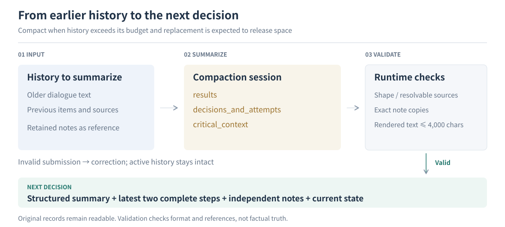
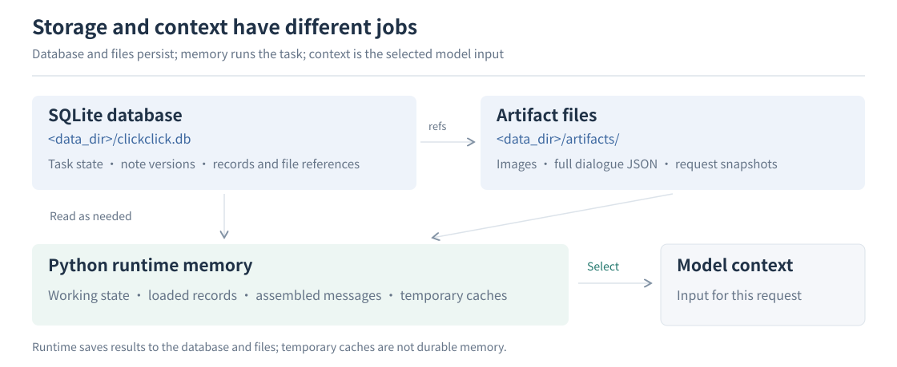

# Memory and context management

[Architecture overview](architecture.md#context-memory-and-skills) · [中文](memory-and-context.zh-CN.md)

**Keep important information, read a bounded context, retrieve detail when needed.** ClickClick stores original records, working notes and structured summaries separately, then assembles the context needed for the current decision.

## What the model sees

The original instruction supplies the goal and user constraints. Planner supplies the current stage and plan; runtime supplies budgets and the latest observation. Notes carry information needed later, while summaries connect earlier execution to recent steps. Each has its own owner.

## Notes: carry information forward

Executor writes a note when information is **needed later, may leave context, and is not already adequately retained**. An address needed in another app qualifies; routine clicks, recovered errors and unchanged failed attempts remain in the original history.

| Content | Purpose | Update behavior |
| --- | --- | --- |
| Body | Complete data, order, sources and necessary uncertainty | Update the same `note_key` for the same subject; earlier versions remain |
| `retained` | Short content directly visible in later decisions | Nonempty text sets it; omission or `null` preserves it; an empty string clears it |
| `unresolved` | A material question still affecting the task outcome | Omission does not clear it; resolution needs an explanation and sources |

`retained` is maintained separately from the body: a body correction may also require updating or clearing its excerpt. Plans own ordinary pending steps; optional additional verification does not automatically become an unresolved question.

| Write operation | Versions and order |
| --- | --- |
| Revise a key | Create a version and keep earlier versions |
| Identical replacement | No new version or refreshed timestamp |
| Append in sequence | Preserve occurrence order, including repeated equal values |

## Compaction: summarize earlier work, keep recent steps intact

A separate compaction session uses the same configured model as Executor and exposes only a summary submission tool. Images are omitted from text compaction; original dialogue, screenshots and note versions remain retrievable.

| Summary section | Keep | Exclude |
| --- | --- | --- |
| `results` | Observed outcomes, artifacts and necessary data | Reports or candidates presented as verified facts |
| `decisions_and_attempts` | Consequential actual attempts, outcomes and scope | Inferred causes, new verification obligations or retry bans |
| `critical_context` | Necessary historical detail absent from the other sections | Copies of the task checklist, current plan or routine action log |

Each item links to its sources. Compaction uses short labels that runtime resolves to durable references. The execution model normally reads concise prose and uses `summary_source` to retrieve the summary and underlying records when details matter.

**Deduplication affects display only.** A summary item is hidden when both its note version and full retained text match a note supplied in the current context. If that note is omitted later, the summary copy reappears. Stored content remains intact; semantic similarity does not authorize merging.

| Compaction rule | Behavior |
| --- | --- |
| Trigger | History exceeds its budget and replacement is expected to release space |
| History budget | 16,000 estimated tokens by default; history only, not the total model window |
| Recent context | Keep the latest two complete execution steps and receipts verbatim |
| Summary capacity | Target 3,000 characters; hard cap 4,000, including headings and separators |
| Invalid submission | Up to three model calls for correction; do not replace active history before validation or forcibly truncate content |

`CLICKCLICK_CHATGPT_HISTORY_TOKENS` configures the ChatGPT history budget; explicit model/role budgets take precedence. A larger budget retains more original text and increases per-request context cost.

## Storage: database, files and runtime memory

The data root defaults to `./data`, configured by `Settings.data_dir`. **A task-history backup needs both the database and the artifact directory.**

| Content | Location |
| --- | --- |
| Current plan, stage, budgets, summary and active dialogue references | The `state_json` column of the `tasks` table in the `clickclick.db` database |
| Notes, observation metadata, stages, events, measurements, summaries and sources | The `agent_records` table in `clickclick.db`; the `kind` column identifies the record type |
| Step and trace records | The `steps` and `traces` tables in the `clickclick.db` database |
| Original dialogue | `artifacts/dialogue/`; database records hold file references |
| Screenshots and interface structure | `artifacts/history_images/`, `trees/`, `som/` |
| Model request and response snapshots | `artifacts/llm/` |
| Working state, loaded content and temporary caches | Python process memory; persistent state is written at checkpoints |

### Finding a note and its earlier versions

**A key names a note; a source reference identifies a particular version of it.** Consider a delivery address the model needs to remember:

| What happens | Stored result | Source reference for retrieval |
| --- | --- | --- |
| Record “8 Pine Road” | Name the note `delivery_address` and save version 1 | `note:delivery_address@1` |
| Correct the address to “18 Pine Road” | Keep the same name and save version 2; version 1 remains | `note:delivery_address@2` |
| Check the originally recorded address | Read version 1 to retrieve “8 Pine Road” | `note:delivery_address@1` |

In the reference, `note` identifies the record type, `delivery_address` is its name, and `@1` selects version 1. The model uses the name to update the note and a versioned reference to retrieve exact saved content.

The database also records the owning task, so two tasks can each have a `delivery_address` note without mixing them. The model's `note_key` is stored as `record_key`; it is a logical name, not an automatically generated row number.

A dialogue file reference such as `dialogue/<hash>.json` is instead a disk path. The database uses it to locate an original message file under `artifacts/`; file paths and versioned note references locate different kinds of stored content.

## Retrieval: read the source when detail matters

| Need | Read path |
| --- | --- |
| A note outside directly retained content | Obtain its source handle from the note directory and use `read_history` |
| Full note and linked sources | `read_history(source=…, full=true)` |
| Basis for a summary | Read `summary_source`, then follow item sources to dialogue or observations |
| An earlier screen | Read an image by observation source; historical images are not current action coordinates |
| An unknown source | Literal keyword search; no match is not proof of absence |

Context assembly selects whole items within its capacity and reports omissions. Known sources remain directly readable; truncated results include continuation handles. Internal tracing IDs stay in storage, while routine prose exposes usable read/update handles.

### Capacity reference

Text lengths are measured in characters, not tokens; item counts are stated separately.

| Content | Capacity |
| --- | --- |
| Ordinary notes | 64 keys; 6,000 per body |
| Retained excerpts | 600 each; 3,000 for the injected packet including metadata |
| Unresolved questions | Up to 8; 400 each |
| Note directory | 2,400 per page |
| Planner / Reviewer recent notes and operation summary | 12,000 each |
| Measurements | Up to 4; 6,000 budget |
| Ordinary history read / full known-source read | 3,000 / 12,000 |
| Keyword search | Up to 6 matching records |

**Limits:** traceable sources do not prove a conclusion correct. Models can omit information, retain stale judgments or misuse notes; original records support checking and correction. Persistent storage does not guarantee lossless recovery from every interruption.

[Architecture](architecture.md) · [Note and storage implementation](../agent/revisable/store.py) · [Structured summary implementation](../agent/revisable/summary.py)
