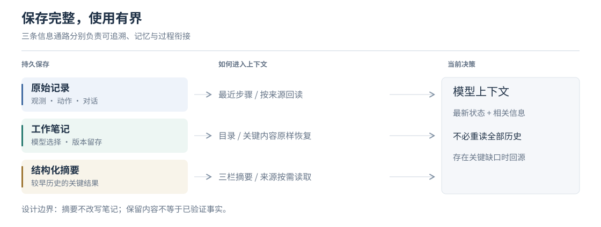
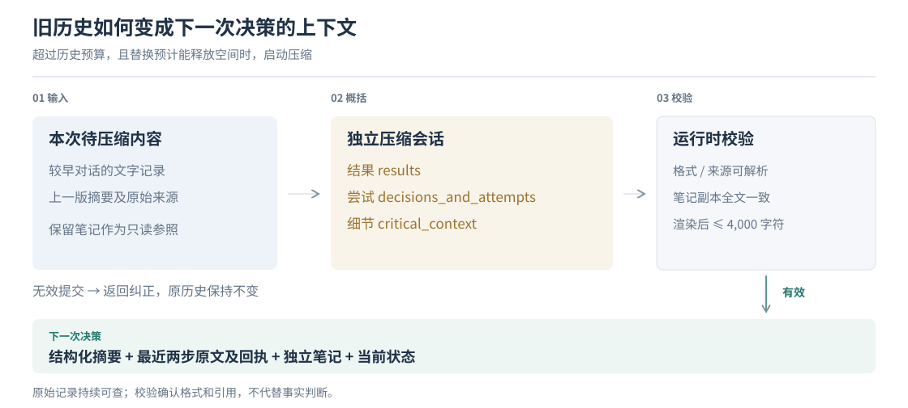
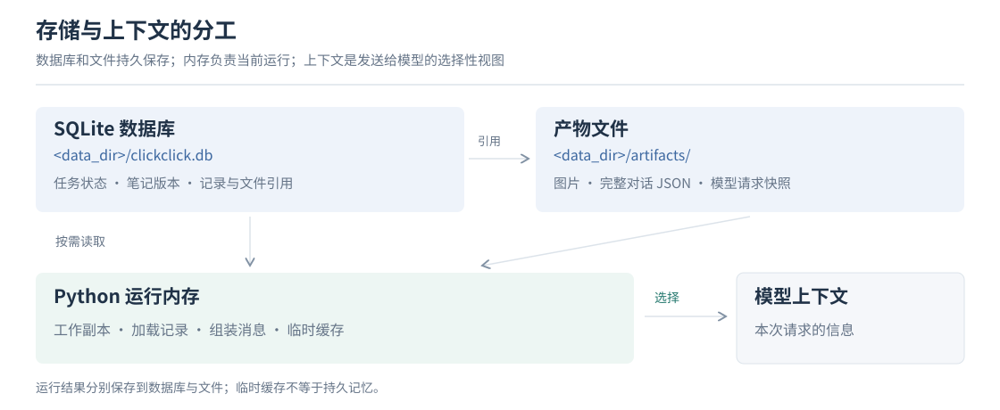

# 记忆与上下文管理

[架构概览](architecture.zh-CN.md#上下文记忆与技能) · [English](memory-and-context.md)

**重要信息留得住，每次决策读得少，需要细节时找得到。** ClickClick 分别保存原始记录、工作笔记和结构化摘要，为模型组装当前任务所需的上下文。

## 模型每次看到什么

原始指令提供目标和用户约束，Planner 提供当前阶段与计划，运行时提供预算和最新观测。笔记保存后续所需的信息，摘要衔接较早的执行过程，各自独立维护。

## 笔记：带走后面需要的信息

Executor 在信息**后续需要、可能离开上下文、尚未充分保留**时写笔记。例如，跨应用录入前保存地址；普通点击、已恢复的错误和重复失败留在原始历史中。

| 内容 | 用途 | 更新方式 |
| --- | --- | --- |
| 正文 | 保存完整数据、顺序、来源和必要的不确定性 | 同一主题更新同一 `note_key`，旧版本保留 |
| `retained` | 选出后续决策要直接看到的短内容 | 非空值设置；省略或 `null` 保持原值；空字符串清除 |
| `unresolved` | 标记仍影响任务结果的实质问题 | 省略不会清除；以带说明和来源的解决记录关闭 |

`retained` 是正文的独立摘录：修改正文时，需要同步纠正或清除已失效的摘录。普通待办由计划管理，可选的进一步核验不自动成为未解决问题。

| 写入动作 | 版本与顺序 |
| --- | --- |
| 修改同一 key | 生成新版本，保留旧版本 |
| 完全相同的覆盖 | 不增版本、不刷新时间 |
| 顺序追加 | 保留发生顺序，相同值的两次发生仍是两条 |

## 压缩：概括旧过程，保留近期原文

压缩由与 Executor 相同配置模型的独立会话完成，只提供摘要提交工具。图片不参与文字压缩，原始对话、截图和笔记版本仍可回查。

| 摘要栏目 | 保留什么 | 不写什么 |
| --- | --- | --- |
| `results` | 已观察结果、产物和必要的数据 | 把转述或候选写成已验证事实 |
| `decisions_and_attempts` | 影响后续选择的实际尝试、结果与范围 | 猜测原因、新增验证要求或重试禁令 |
| `critical_context` | 前两栏没有覆盖的必要历史细节 | 复制任务清单、当前计划或普通操作日志 |

每条摘要关联来源。压缩会话使用短标签，运行时将它们还原为持久引用；执行模型平时阅读简短正文，缺少细节时通过 `summary_source` 回查摘要及原始记录。

**去重只影响展示。** 摘要条目与本次已提供笔记的版本、保留全文都相同时，隐藏摘要中的副本；笔记未被提供时，副本重新显示。存储中的内容不删除，也不按语义相似度合并。

| 压缩规则 | 行为 |
| --- | --- |
| 触发 | 历史超过预算，且摘要替换预计能释放空间 |
| 历史预算 | 默认 16,000 个估算 token；只计历史，不等于模型总窗口 |
| 近期保留 | 最近两个完整执行步骤及回执不压缩 |
| 摘要容量 | 目标 3,000 字符，硬上限 4,000，包含标题与分隔符 |
| 提交失败 | 最多三轮模型调用纠正；有效提交前不替换活跃历史，不强行截断 |

ChatGPT 的历史预算可用 `CLICKCLICK_CHATGPT_HISTORY_TOKENS` 设置；显式模型／角色预算优先。预算越高，原文保留越多，每次请求的上下文成本也越高。

## 存储：数据库、文件、内存各司其职

默认数据根目录为 `./data`，可通过 `Settings.data_dir` 更改。**备份任务历史需要同时保留数据库与产物目录。**

| 内容 | 位置 |
| --- | --- |
| 当前计划、阶段、预算、摘要、活跃对话引用 | `clickclick.db` 数据库中，`tasks` 表的 `state_json` 字段 |
| 笔记、观测元数据、阶段、事件、测量、历次摘要及来源 | `clickclick.db` 数据库的 `agent_records` 表，用 `kind` 字段区分记录类型 |
| 步骤与追踪记录 | `clickclick.db` 数据库的 `steps` 表和 `traces` 表 |
| 原始对话 | `artifacts/dialogue/`；数据库保存文件引用 |
| 截图与界面结构 | `artifacts/history_images/`、`trees/`、`som/` |
| 模型请求与响应快照 | `artifacts/llm/` |
| 当前工作副本、已加载内容、临时缓存 | Python 进程内存；在保存点写回持久存储 |

### 如何找到同一条笔记，以及它的旧版本

**key 是笔记的名称，来源引用则指定“哪条笔记的哪个版本”。** 例如，模型要记住一个配送地址：

| 发生的事情 | 保存结果 | 回查用的来源引用 |
| --- | --- | --- |
| 首次记下“松林路 8 号” | 命名为 `delivery_address`，保存第 1 版 | `note:delivery_address@1` |
| 地址更正为“松林路 18 号” | 沿用同一个名称，保存第 2 版；第 1 版仍在 | `note:delivery_address@2` |
| 想确认最初记下的地址 | 按第 1 版的引用读取，得到“松林路 8 号” | `note:delivery_address@1` |

引用中的 `note` 表示笔记，`delivery_address` 是名称，`@1` 表示第 1 版。模型使用这个名称更新笔记，使用带版本的引用回读确切内容。

数据库还会记录所属任务，因此两个任务都可以有名为 `delivery_address` 的笔记，互不混淆。`note_key` 在数据库中称为 `record_key`；它是逻辑名称，不是数据库自动生成的行号。

对话文件的 `dialogue/<hash>.json` 则是磁盘路径：数据库用它找到 `artifacts/` 下的原始消息文件，与上述笔记引用是两种不同的定位方式。

## 回查：按需读取完整来源

| 需要什么 | 如何获得 |
| --- | --- |
| 当前保留内容之外的笔记 | 从笔记目录取得来源句柄，调用 `read_history` |
| 笔记全文及关联来源 | `read_history(source=…, full=true)` |
| 摘要的依据 | 读取 `summary_source`，再沿条目来源读取原始对话或观测 |
| 早先的画面 | 按观测来源读取图片；历史图片不作为当前点击坐标 |
| 不知道确切来源 | 字面关键词查询；无匹配不表示信息不存在 |

上下文按容量选取完整条目，标明省略；已知来源可直接回读，截断结果提供继续读取位置。内部追踪编号保存在记录中，日常正文只保留可用的读取／更新句柄。

### 容量参考

文本长度按字符计数，不是 token；条目数量单独标明。

| 内容 | 容量 |
| --- | --- |
| 普通笔记 | 64 个 key；每条正文 6,000 |
| 保留摘录 | 每条 600；整个注入包 3,000，包含元数据 |
| 未解决问题 | 最多 8 条；每条 400 |
| 笔记目录 | 每页预算 2,400 |
| Planner / Reviewer 的近期笔记、操作摘要 | 各自预算 12,000 |
| 工具测量 | 最多 4 条；预算 6,000 |
| 普通历史读取 / 指定来源全文读取 | 3,000 / 12,000 |
| 关键词查询 | 最多 6 条匹配记录 |

**能力边界：** 来源可追溯不等于结论正确。模型仍可能遗漏信息、保留过时判断或误用笔记；原始记录用于核对和纠正。持久保存也不等于任意中断都能无损恢复。

[架构](architecture.zh-CN.md) · [笔记与存储实现](../agent/revisable/store.py) · [结构化摘要实现](../agent/revisable/summary.py)
