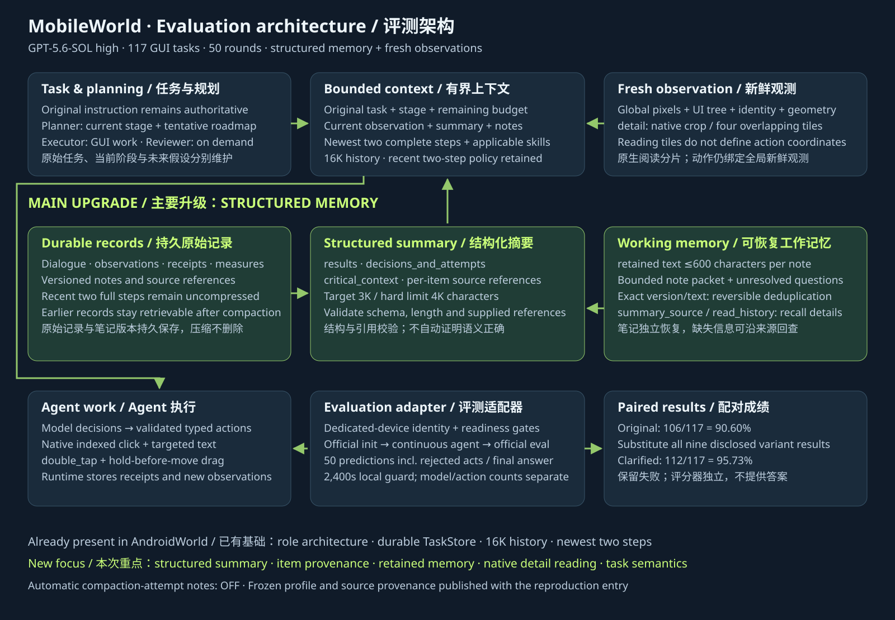

# MobileWorld evaluation architecture / MobileWorld 评测架构

[Architecture](architecture.md) · [中文架构](architecture.zh-CN.md) · [Memory](memory-and-context.md) · [复现入口](mobileworld-reproduction.zh-CN.md) · [Reproduction](mobileworld-reproduction.md)

This describes the runtime used for `full-gui-paired-20261001-v2`, which produced **112/117 (95.73%) clarified and 106/117 (90.60%) original-wording** results. The main upgrade since the AndroidWorld September 21 evaluation is **structured compaction and recoverable memory/context**, alongside on-demand native-detail observations and richer device actions. The Planner/Executor/Reviewer arrangement, durable task storage, 16,000-token history setting and preservation of the newest two full execution steps already existed in AndroidWorld; they are not claimed as new here.

本文对应本次成绩实际使用的评测运行时。相比 AndroidWorld 9 月 21 日评测，重点升级是**结构化压缩摘要与可恢复的记忆、上下文**，同时增加原生像素细节观测和动作能力。角色架构、持久任务存储、16,000 历史 token 及最近两步完整保留是已有基础，不计作新增功能。后续实验不属于这次成绩配置。

## Verified changes / 已核实变化

| Area / 方面 | AndroidWorld evaluation / AndroidWorld 评测 | MobileWorld evaluation / MobileWorld 评测 |
| --- | --- | --- |
| Historical compaction / 历史压缩 | Single free-text summary, up to 3,000 characters / 单段自然语言摘要，上限 3,000 字符 | `clickclick.summary.v2`: `results`, `decisions_and_attempts`, `critical_context`; 3,000-character target, 4,000 hard limit including headings / 三类结构化历史，含标题硬上限 4,000 字符 |
| Provenance / 来源 | Compaction record points to source dialogue blocks / 压缩记录关联对话块 | Every summary item binds supplied source labels to persistent references; unknown references rejected / 每条摘要绑定持久来源，拒绝未知引用 |
| Working memory / 工作记忆 | Versioned notes and independently restored unresolved questions / 版本化笔记、独立恢复未解决问题 | Additional `retained` text on notes, up to 600 characters per note; bounded 3,000-character restoration packet, with directory access for omitted notes / 新增短保留正文、有界自动恢复包，未送达笔记仍可按目录回查 |
| Note/summary repetition / 笔记与摘要重复 | Prompt asks summarizer to omit copied notes / 通过提示避免重复 | Exact note version and verbatim retained text permit reversible display deduplication; omitted notes make summary text visible again / 仅相同版本和完整保留正文允许可逆展示去重 |
| Recall / 回查 | Source-based or keyword history reads / 来源及关键词检索 | `summary_source` exposes item provenance, then original dialogue, notes or observations can be read; raw records remain intact / 可沿摘要来源回读原始记录，不删除原始证据 |
| Observation / 观测 | Fresh snapshot/sequence, global screenshot and accessibility structure, action-reference checks / 新鲜单帧及序列、全局图片与树、动作观测引用校验 | Adds `observe_screen(mode="detail")`: fresh native capture through existing fences, locator overview and selected crop or four overlapping tiles; read-only tiles carry observation identity and native geometry / 新增原生细节观测、定位缩略图与裁剪或四块重叠分片，保留观测身份与原生几何 |
| Device actions / 设备动作 | Indexed native clicks, coordinate gestures, targeted text and skill-authorized compounds / 索引原生点击、坐标手势、定向输入及技能授权组合 | Adds `double_tap` and `drag.hold_before_move`, retaining validated global coordinate space / 新增双击与持续按住后拖动，继续绑定全局坐标系 |
| Task semantics / 任务语义 | Original task and current stage supplied separately / 原始任务与当前阶段分别提供 | Frozen prompts strengthen original values, scope and relationships, distinguish current stage from tentative future roadmap, and preserve source coverage while traversing long content / 加强原始值、范围和关系约束，区分当前阶段与未来假设，保留长内容遍历覆盖信息 |
| Evaluation budget / 评测预算 | AndroidWorld's frozen per-task protocol / AndroidWorld 固定逐题协议 | MobileWorld adapter enforces 50 prediction rounds including final answers and rejected attempts, separately from model calls and physical subactions / MobileWorld 适配器执行 50 预测回合计数，终止回答和被拒动作也计入 |

## Context assembly / 上下文组装

Executor receives the original instruction, current stage and plan revision, budget, current actionable observation, structured historical summary, newest two complete execution steps, note directory, retained-note packet, unresolved questions and applicable skill context. These are independently assembled; a summary omission cannot erase an original requirement or stored note. Planner and Reviewer use bounded task/history projections rather than inheriting every raw interaction.

Executor 上下文分别组装原始任务、当前阶段与计划版本、预算、可操作的新鲜观测、结构化历史摘要、最近两步完整交互、笔记目录、短保留正文、未解决问题及适用技能。摘要省略不等于撤销要求或删除记忆。Planner 与 Reviewer 使用有界任务与历史投影。

Compaction is a separate call using the Executor model configuration. Its schema validates sections, length and supplied source references; this checks structure and provenance, not semantic truth. Model-written notes and summaries remain fallible. Raw dialogue, screenshots, measurements and note versions are durable and retrievable. Automatic compaction-attempt note generation is **disabled in this scored profile**.

压缩使用与 Executor 相同配置模型的独立会话。校验覆盖栏目、长度和来源引用，不自动证明摘要语义正确；模型笔记和摘要仍可能出错。原始对话、截图、测量和笔记版本保留可查。本次成绩配置**未启用压缩自动生成尝试笔记**。

## Observation and scoring boundaries / 观测与评分边界

The observation package combines capture identity, pixels, UI structure, geometry and acceptance/freshness metadata. Native detail capture uses the existing deadline and capture fences. Detail tiles support reading; they do not become coordinate action references or reuse an old accessibility overlay. Actions continue to bind the accepted fresh global observation. Pixels and UI structure are asynchronous, so this does not assert an atomic snapshot of every animated element.

观测包组合身份、像素、UI 结构、几何和接受条件、新鲜度元数据。细节获取沿用捕获期限与边界；阅读分片不能直接作为动作坐标依据，也不沿用旧树标注。动作仍绑定被接受的新鲜全局观测。像素与 UI 树异步采集，不宣称动画界面的所有部分原子同步。

The official environment initializes tasks and evaluates final state after execution. Readiness, session, task-specific clock and explicit device-identity gates sit outside the model loop. The clarified goals and the two-case public fixture account context are disclosed inputs; neither changes evaluator predicates or supplies expected answers.

官方环境初始化任务，执行结束后独立判定最终状态。就绪、会话、逐题时钟与专用设备身份检查位于模型循环之外。澄清目标和两题账号环境信息均作为公开输入披露，不修改评分条件或提供预期答案。

## Published implementation / 公开实现

The [frozen runtime](../evaluation/mobileworld/reproduction/runtime/) publishes the evaluation-era implementation separately from the live runtime. See [structured summary](../evaluation/mobileworld/reproduction/runtime/agent/revisable/summary.py), [context restoration](../evaluation/mobileworld/reproduction/runtime/agent/revisable/dialogue.py), [note packet](../evaluation/mobileworld/reproduction/runtime/agent/revisable/store.py), [history access](../evaluation/mobileworld/reproduction/runtime/agent/revisable/recall.py), [native detail observations](../evaluation/mobileworld/reproduction/runtime/agent/screen_detail.py), and [source provenance](../evaluation/mobileworld/reproduction/provenance.json).

冻结实现与日常运行时分别提供，公开仓库无需引入后续实验才能复现这次配置。复现文档说明部署、完整运行、恢复、哈希校验及历史字节恢复范围。
