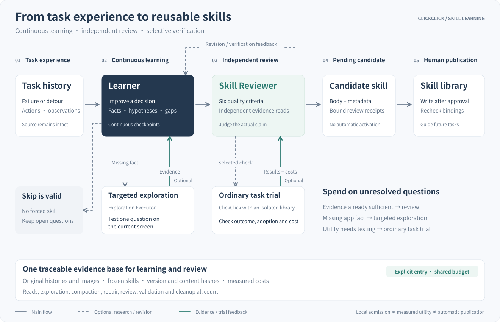

# Skill self-improvement

[README](../README.md) · [中文](skill-evolution.zh-CN.md) · [Architecture](architecture.md) · [Skills guide](../skills/README.md)

**Turn failures and detours from real tasks into guidance for the next run.** ClickClick's Learner analyzes task histories, explores missing app facts when needed, and proposes conditional skill revisions. An independent Skill Reviewer checks their quality and selects necessary trials with ordinary ClickClick execution.

Self-improvement here means updating file-based skill knowledge, not training model weights. **Design and experimental status as of October 8, 2026:** local admission, execution benefits and some reuse have been demonstrated. Learning still requires an explicit research entry point; candidates enter pending review, and automatic publication is not implemented.

## What is learned: a better decision

Useful knowledge changes a future decision: a hidden entry point, a control's scope, a conditional shortcut, an observed pitfall, or information and state that must be preserved. Repeating the clicks from one task is insufficient.

Learning targets two situations:

- **Successful tasks with detours.** Extract the working route from the existing history, checking whether earlier attempts produced state needed later. Omit avoidable actions while retaining saves, identity checks and result verification.
- **Failed tasks.** First retain narrowly supported local knowledge, then explore missing facts. A complete successful route is not required to learn a useful pitfall, but an unknown breakthrough cannot become a verified procedure.

An action is not inherently wasteful. Opening a menu may be a detour for renaming and necessary for another goal. Learner must describe the purpose, observable conditions, changed decision, original cost and replacement overhead, retaining unknown costs. One failure cannot establish a universal ban. Efficient sources, sufficient existing guidance or inadequate evidence may legitimately produce a skip.

## From task experience to a candidate skill

The main flow runs left to right; exploration and trials are optional branches below it. The loops address evidence gaps, and trial results also return to the continuous research conversation. Not every candidate requires device exploration or another task run. After successful checks, a final Reviewer verdict with no remaining checks or revisions lets the host archive actual feedback and finish without an extra closing model request. Failed, incomplete or disputed results still return to analysis.

### Responsibilities

- **Source task records** retain instructions, actions, observations, notes and outcomes. Learning references them without changing the source task or replacing benchmark scores.
- **Learner** analyzes dependencies, failures and detours; chooses propose, explore or skip; tracks facts, hypotheses and unknowns; and writes skill bodies and retrieval metadata.
- **Exploration Executor** reuses observation, action validation and device tools to test a concrete question on the current screen. Historical images are evidence, not coordinates for current actions.
- **Skill Reviewer** uses a separate context and reads original evidence and frozen guidance independently. It checks quality and selects necessary verification. It does not inherit the entire Learner conversation or receive device/publication tools. Its responsibility differs from the Reviewer role in ordinary task execution.
- **The evaluation controller and ordinary ClickClick** run selected checks with isolated skill libraries. The controller coordinates conditions, costs and device lifecycle; AndroidWorld/MobileWorld official initialization and scoring serve their respective experiments. The ordinary executor receives the candidate, not the full research conversation.
- **Pending review and human approval** bind the exact candidate, base version, review and applicable validation. Approval rechecks those bindings; an old receipt cannot authorize a changed body or library.

## Independent review: local facts and task benefit are separate

Skill Reviewer checks six criteria: **root cause, transferability, conflicts, regression risk, concision and marginal value**. It asks whether applicability is detectable before the changed decision, whether existing knowledge already covers it, whether omitted actions create necessary state, and whether the decision value justifies new guidance.

Three conclusions remain distinct:

1. **Local knowledge is supported.** Native observations establish a location, semantic distinction or conditional rule with useful, nonredundant decision value. `source_evidence` admission does not require prior whole-task success, nor establish average savings or complete transfer.
2. **Candidate execution demonstrates task benefit.** Ordinary execution independently assesses outcome, delivery, action adoption and full cost. `measured_utility` claims require the corresponding matched comparisons and coverage; local admission is not a substitute.
3. **The candidate may enter the canonical library.** Applicable evidence, all six review criteria, candidate/base/library/runtime bindings and environment conditions remain valid, followed by current human approval. A passing review is not publication.

Preflight catches concrete conflicts, invalid scope and low-value drafts before expensive execution. Unknown future benefit may proceed to necessary verification but cannot become a fact. Confirmed regression and unresolved environment effects cannot be erased by narrowing the claim.

## What to verify, and when to rerun

Learner may propose a verification goal. Independent Reviewer selects decision-changing checks already declared by the trusted evaluator. Existing evidence may suffice; one missing fact may warrant a local probe; execution-effect questions may require ordinary task trials.

Verification separates catalog exposure, Planner reading or selection, exact Executor delivery, and actual mechanism adoption. Activation alone does not demonstrate adoption. An executor's completion report does not replace independent outcome checks.

Candidate body, base library, task, model, initialization and runtime contracts bind source and new results. Completed evidence can be reused under exact bindings; a new body cannot inherit an older body's outcomes. Environment failures, unscored executions and unknown costs remain separate from skill scores and zero-cost claims.

Replication has several meanings:

- **Same-goal repetition** checks completion recurrence for an exact body, not transfer to changed inputs.
- **Different-input trials** test the unchanged rule on new task data or conditions.
- **Blank-conversation reacquisition** tests independent extraction from the source, not parameter transfer.

There is no default full comparison matrix. Claims requiring complete utility coverage must still satisfy it; local knowledge does not require endless verification of unclaimed global benefits.

## Continuous analysis and context management

Learner retains research progress within a bound learning job. The current goal, candidate, supported facts, failed attempts, review disputes, unknowns and remaining budget move across phases rather than restarting settled analysis.

Initial input contains necessary task facts, counts and a referenced chronological action directory. Original records, images and complete skill bodies are paged on demand. Capacity-deferred results retain the original call and exact source; undelivered content is not treated as absent. Frozen full-file hashes and role-projection hashes are distinct: a Planner projection is not compared against an Executor hash.

When history exceeds its window, referenced checkpoints preserve dependencies and unresolved questions while originals remain retrievable. Format/reference validation does not prove semantic fidelity. Learning checkpoints differ from ordinary Executor history summaries; see [Memory and context design](memory-and-context.md) for task notes and summaries.

Stable rules and tool contracts are placed before changing phase facts and budgets where possible for prompt caching. Actual cache usage and provider tokens are measured separately. Evidence, current budgets and context limits take priority over cache continuity. No new case index, background memory agent, experience-pruning service or arbitrary hard skill-token quota is introduced.

## Output: conditional guidance and retrieval metadata

Candidates use existing `SKILL.md` conventions in the relevant app core or workflow, in sections such as Procedure, Verification, Pitfalls and Hints. Unrelated valid guidance and necessary checks remain intact. Research costs, disputes and evidence directories stay in analysis records rather than filling runtime skill text.

Supported semantic fields—`description`, `tags`, `triggers`, `app_aliases` and `capability`—may change under the same independent review. Kind-specific constraints still apply: workflows use capability and do not accept triggers. Package names, skill identity, interface scope and action authorization remain protected; learning does not grant arbitrary action or script permissions. See the [Skills guide](../skills/README.md) for formatting and delivery.

Reusable rules refer to purposes and observable mechanisms rather than this task's filename, amount, answer set or historical coordinates. Transfer-shaped wording is not transfer evidence. Rediscovering authored knowledge does not automatically establish incremental value over the complete authored library.

## Costs and device environment

Evidence reading, exploration, compaction, repair, review and validation share explicit request, action and time budgets; retries do not reset them. Device exploration requires user authorization and can be cancelled. Candidates remain local and pending until independent review and validation complete.

## Current capability and remaining limits

Discoverable GUI mechanisms in this cohort reached a usable experimental stage: autonomous local procedures and pitfalls, independent review, some ordinary task benefits, and limited replication and cross-input evidence. Separate local rules are not complete task-family procedure packages.

Complex cross-app failure exploration, long-run average utility, causal effects across starting states, production cost and statistical reliability remain unresolved. Complete authored skills are a direction, not this phase's mandatory parity threshold. Fixed-test-script generation remains deferred. Automatic publication, continuous pruning and unrestricted autonomous exploration are not implemented capabilities.

## Implementation entry points

- [learning.py](../agent/skills/learning.py): diagnosis, candidate contracts, independent review and learning cycle.
- [analysis_session.py](../agent/skills/analysis_session.py): continuous conversation, checkpoints and feedback archives.
- [exploration.py](../agent/skills/exploration.py), [research_tools.py](../agent/skills/research_tools.py): evidence reading, execution and environment integration.
- [admission.py](../agent/skills/admission.py), [verification.py](../agent/skills/verification.py): claim-scoped admission and isolated validation.
- [pending.py](../agent/skills/pending.py): pending artifacts and approval-time binding checks.
