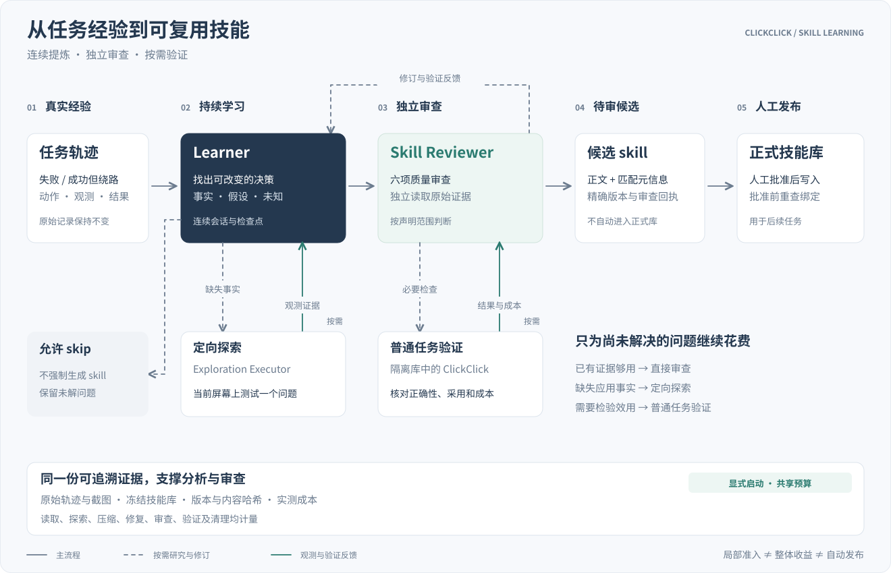

# Skills 自进化

[首页](../README.zh-CN.md) · [English](skill-evolution.md) · [Skills 指南](../skills/README.zh-CN.md)

ClickClick 可以从已经执行的任务中提炼应用操作经验，形成可复用的 Skill。例如，找出一个隐藏入口、记录某类控件的使用条件，或为走过弯路的任务提出更短的操作路线。这里的“自进化”是更新技能文件中的知识，不是训练模型权重。

## 如何优化一个工作流

1. 在 Console 打开任务详情，点击 **“优化我的工作流”**。
2. 设置模型请求、设备动作和时间上限，确认模型开销及本次设备操作授权。
3. 查看学习进度。ClickClick 分析原任务记录，必要时操作设备补充证据，并让独立 Skill Reviewer 审查候选知识。你可以停止本次优化。
4. 有候选生成后，打开 **“技能 → 待审 Pending”**，查看正文、修改差异和审查结果。
5. 符合审查要求的候选由你决定是否批准；批准前不会写入正式技能库。缺少证据或与当前技能版本不匹配的候选，需要先解决相应问题。

学习需要额外模型请求，也可能操作手机。请保留可用于探索的应用状态，并先保存正在编辑的内容。设置学习预算不会自动启动优化；普通任务结束后也不会自动执行额外学习。

## 学什么：改变下一次决策

值得学习的不是这次点了哪些按钮，而是哪些应用机制能改变下一次决策：隐藏入口、控件作用域、条件化捷径、已证实的避坑点，以及必须保留的信息或状态。

学习主要来自两种场景：

- **任务成功但绕路。** 从真实成功轨迹找出正确路径，分析之前的尝试是否产生后续需要的状态；只省去不必要的操作，保留保存、身份确认和结果核验。
- **任务失败。** 先提炼已有证据明确支持的局部知识，再针对缺失事实探索。没找到完整成功路线，不妨碍保存一个有价值且成立的窄规则；未知突破口不能写成已验证流程。

动作本身不天然是绕路。打开菜单在重命名任务里可能浪费时间，在其他任务里可能必不可少。Learner 需要说明目的、可观察条件、待改变的决策、原开销和替代开销；不能从一次失败推导出“永远不要用这个入口”。高效完成、已有指南足够或缺乏可靠证据时，允许直接 skip。

## 从任务经验到候选 skill

主流程从左到右，探索与验证位于下方的按需支路。图中的回路按证据缺口选择，不要求每个候选都探索设备或复跑任务；验证结果同时回到连续研究会话。未完成、失败或有争议的结果仍回传分析。

### 模块分工

- **原任务记录**保留指令、动作、观测、笔记与结果。学习使用其来源引用，不篡改原任务或覆盖评测成绩。
- **Learner**分析必要路径、失败尝试和绕路，选择 propose、explore 或 skip，维护当前知识、假设及未知，生成正文和匹配元信息。
- **探索 Executor**复用已有观察、动作校验与设备工具，在当前屏幕上测试一个具体问题。历史截图是证据，不是当前动作坐标的依据。
- **Skill Reviewer**使用独立上下文，按需读取原始证据及冻结指南，审查规则质量并选择必要验证。它不继承 Learner 的整段对话，也没有设备操作或发布权限；它与普通任务执行中的 Reviewer 角色职责不同。
- **评测控制器与普通 ClickClick**在隔离技能库中执行所选检查。控制器协调条件、成本和设备生命周期；AndroidWorld/MobileWorld 的官方初始化与评分用于相应实验。普通执行器使用候选完成原任务，不接收 Learner 的整段研究对话。
- **pending 与人工批准**保存精确候选、基础版本、审查和相应验证记录。批准前重查绑定，旧回执不能授权一个已改变的正文或库。

## 独立审查：局部事实与整任务收益分开

Skill Reviewer 检查六项：**根因、迁移性、冲突、退化风险、简洁性、边际价值**。它要检查规则能否在改变决策之前识别适用条件，是否与已有知识重复，是否省掉了有用状态，以及预期收益是否值得新增指导。

三个结论分别记录：

1. **局部知识成立。** 原始观测支持某个入口、语义区别或条件规则，且它有非重复的决策价值。可走 `source_evidence` 准入，不要求先证明整任务成功；这不证明平均节省或完整迁移。
2. **候选执行取得任务收益。** 普通执行独立检查结果、实际加载、动作采用和完整成本。`measured_utility` 声明需满足相应匹配对照与覆盖要求，不能靠局部准入替代。
3. **有资格写入正式库。** 相应证据、六项审查、候选/基础库/运行合同绑定及环境要求仍有效，并经过当前人工批准。通过审查不意味着已经发布。

预审先发现具体冲突、错误范围和低价值内容，避免为明显不合格的草稿花费完整执行成本。未知的未来收益可进入必要验证，但不能被写成事实。已经观察到的退化或未解决环境影响也不能靠缩小声明抹掉。

## 多应用候选与局部验收

同一学习作业可提出多个 skill 文件及其依赖关系。第二个应用自身的控件或功能知识归属于该应用；发起应用的 workflow 只保留必要的跨应用交接。优先修复失败、明显副作用和显著操作开销，不要求消除每次无关紧要的绕路。

候选组放入一个冻结的联合 overlay，Reviewer 逐文件审查六项标准，并分别记录局部效果为 supported、contradicted 或 unassessed。效果证据必须指向实际动作和观测，不能仅以加载正文或整任务成功作为采用证明。最终审查新增的必要检查也会执行；完全相同的正文、基础库与运行合同下，已完成检查可复用，不默认逐文件铺开对照矩阵。

整任务失败或一个文件不合格，不否定另一个已独立证明有效的文件。依赖未通过、已知退化和文件中未证实的其他规则仍会阻断受影响候选；文件是批准单位，不能借其中一条有效规则夹带其他内容。候选组的绑定回执在每次人工批准时重新核对，只批准条件满足的文件。

已完成候选的完整评审与验证记录通过带 hash 的来源入口按需读取，当前正文、声明范围和关键结果继续保留在会话中；共享规则合同只传一次，各文件的指南身份仍独立绑定。这减少重复输入，同时保留连续研究和回查能力。

## 验证什么，什么时候复跑

Learner 可以提出验证目标，独立 Reviewer 从可信评测器已声明的检查中选择能改变判断的部分。已有原始证据足够时不运行新任务；缺失一个事实时可先做局部探索；需要检验执行效果时再跑普通任务。

普通验证需要分清：候选被列入目录、Planner 读取或选择、Executor 收到精确正文、实际动作采用规则。只有加载记录，不能证明机制采用；只有执行器的完成报告，不能替代独立结果检查。

来源和新结果通过候选正文、基础库、任务、模型、初始化和运行合同绑定。绑定一致且已完成的结果可复用；新正文不能继承旧正文成绩。环境故障、未评分执行和未知成本单独保留，不记成 skill 失败、成功或零成本。

复现证据也有不同含义：

- **同目标重跑**检验指定正文在相同目标下的完成复现，不证明换输入迁移。
- **不同输入验证**检验原样规则能否用于新的任务数据或条件。
- **空白会话重学**检验能否从原来源独立提炼相近知识，不替代迁移验证。

默认不铺开完整对照矩阵。若声明要求完整效用覆盖，相应检查仍必须完成；局部知识不因缺少未声明的全局收益证明而被无限验证。

## 连续分析与上下文管理

Learner 在同一学习作业内持续积累研究进度。当前目标、候选、已验证事实、失败尝试、审查争议、未知和剩余预算随阶段传递，避免换阶段就重新分析已经解决的问题。

初始输入提供必要的任务信息、计数和带引用的动作顺序目录。原始记录、截图和完整 skill 正文按需分页读取；结果因容量延期时，保留原调用与精确来源，不能把未交付内容当成不存在。冻结指南的完整文件 hash 与角色正文 hash 分开，Planner 的投影不拿 Executor 的 hash 判断。

历史超限时生成带来源的检查点，保留必要依赖与未解问题，原始记录仍可回查。格式和引用校验不证明摘要语义一定正确。学习检查点也不同于普通 Executor 的执行历史摘要；普通任务的笔记和摘要机制见[记忆与上下文详设](memory-and-context.zh-CN.md)。

固定规则和工具合同尽量位于稳定前缀，变化的阶段事实和预算放在后部，以利用 prompt cache。实际命中和提供方用量单独计量，不为缓存舍弃必要证据或沿用旧预算。

## 输出：条件化知识与检索元信息

候选按现有 `SKILL.md` 格式写入相应 app core 或 workflow，落在 Procedure、Verification、Pitfalls、Hints 等适合的段落。保留无关有效知识和必要核验；研究开销、争议与证据目录保存在分析记录，不全部塞入运行时技能。

受支持的语义匹配字段 `description`、`tags`、`triggers`、`app_aliases`、`capability` 可与正文一起接受审查。各 skill 类型的格式限制仍有效，例如 workflow 使用 capability、不接受 triggers。包名、技能身份、界面作用域和执行授权等确定性字段受保护，不因学习打开任意动作或脚本权限。文件格式与交付机制见[Skills 指南](../skills/README.zh-CN.md)。

一条可复用规则应围绕目的和可观察机制表达，避免固化本次文件名、金额、答案组合或历史坐标。但写得可迁移不等于已经验证迁移；自主重新发现人工规则也不自动证明相对完整人工库有新增价值。

## 成本与设备环境

读取、探索、压缩、修正、评审和验证共用明确的请求、动作与时间预算；重试不会重置额度。设备探索需要用户授权，学习任务可以取消。候选结果保留在本地 pending，独立评审与验证完成后才能采用。

## 实现入口

- [learning.py](../agent/skills/learning.py)：诊断、候选格式、独立审查与学习闭环。
- [analysis_session.py](../agent/skills/analysis_session.py)：连续会话、检查点和反馈归档。
- [exploration.py](../agent/skills/exploration.py)、[research_tools.py](../agent/skills/research_tools.py)：证据读取、探索执行与环境衔接。
- [admission.py](../agent/skills/admission.py)、[verification.py](../agent/skills/verification.py)：声明范围准入与隔离验证。
- [candidate_group.py](../agent/skills/candidate_group.py)：多文件归属、依赖、联合验证和局部准入。
- [pending.py](../agent/skills/pending.py)：待审产物与批准前的绑定检查。
